# VAES Benutzerhandbuch

**Vereins-Arbeitsstunden-Erfassungssystem (VAES)**
Version 1.4.0
Stand: April 2026

---

## Inhaltsverzeichnis

1. [Einleitung](#1-einleitung)
2. [Erste Schritte](#2-erste-schritte)
   - 2.1 [Einladung und Passwort einrichten](#21-einladung-und-passwort-einrichten)
   - 2.2 [Zwei-Faktor-Authentifizierung (2FA) einrichten](#22-zwei-faktor-authentifizierung-2fa-einrichten)
   - 2.3 [Anmelden](#23-anmelden)
   - 2.4 [Passwort vergessen](#24-passwort-vergessen)
   - 2.5 [Profil und Passwort aendern](#25-profil-und-passwort-aendern)
3. [Dashboard](#3-dashboard)
   - 3.1 [Schnellaktionen](#31-schnellaktionen)
   - 3.2 [Ungelesene Nachrichten](#32-ungelesene-nachrichten)
   - 3.3 [Soll-Stunden-Fortschritt](#33-soll-stunden-fortschritt)
   - 3.4 [Rollenuebersicht](#34-rollenuebersicht)
4. [Navigation](#4-navigation)
   - 4.1 [Hauptnavigation](#41-hauptnavigation)
   - 4.2 [Breadcrumb-Navigation](#42-breadcrumb-navigation)
   - 4.3 [Benachrichtigungsglocke](#43-benachrichtigungsglocke)
5. [Arbeitsstunden erfassen](#5-arbeitsstunden-erfassen)
   - 5.1 [Neuen Eintrag erstellen](#51-neuen-eintrag-erstellen)
   - 5.2 [Eintrag als Entwurf speichern](#52-eintrag-als-entwurf-speichern)
   - 5.3 [Eintrag direkt einreichen](#53-eintrag-direkt-einreichen)
   - 5.4 [Eintrag bearbeiten](#54-eintrag-bearbeiten)
   - 5.5 [Eintrag loeschen](#55-eintrag-loeschen)
6. [Meine Eintraege verwalten](#6-meine-eintraege-verwalten)
   - 6.1 [Uebersichtsliste](#61-uebersichtsliste)
   - 6.2 [Filtern und Sortieren](#62-filtern-und-sortieren)
   - 6.3 [Detailansicht](#63-detailansicht)
7. [Freigabe-Workflow](#7-freigabe-workflow)
   - 7.1 [Status-Uebersicht](#71-status-uebersicht)
   - 7.2 [Eintrag einreichen](#72-eintrag-einreichen)
   - 7.3 [Eintrag zurueckziehen](#73-eintrag-zurueckziehen)
   - 7.4 [Eintrag stornieren](#74-eintrag-stornieren)
   - 7.5 [Stornierten Eintrag reaktivieren](#75-stornierten-eintrag-reaktivieren)
   - 7.6 [Workflow-Diagramm](#76-workflow-diagramm)
8. [Dialog-System](#8-dialog-system)
   - 8.1 [Nachrichten lesen](#81-nachrichten-lesen)
   - 8.2 [Nachricht senden](#82-nachricht-senden)
   - 8.3 [Rueckfragen und Antworten](#83-rueckfragen-und-antworten)
   - 8.4 [Benachrichtigungen](#84-benachrichtigungen)
9. [Events und Veranstaltungen](#9-events-und-veranstaltungen)
   - 9.1 [Eventliste](#91-eventliste)
   - 9.2 [Kalenderansicht](#92-kalenderansicht)
   - 9.3 [Event-Details und Aufgaben uebernehmen](#93-event-details-und-aufgaben-uebernehmen)
   - 9.4 [Meine Events](#94-meine-events)
   - 9.5 [Automatische Arbeitsstunden aus Events](#95-automatische-arbeitsstunden-aus-events)
   - 9.6 [iCal-Abonnement (Kalender-Integration)](#96-ical-abonnement-kalender-integration)
10. [Reports und Exporte](#10-reports-und-exporte)
    - 10.1 [Report-Seite](#101-report-seite)
    - 10.2 [Filter verwenden](#102-filter-verwenden)
    - 10.3 [Zusammenfassung](#103-zusammenfassung)
    - 10.4 [PDF-Export](#104-pdf-export)
    - 10.5 [CSV-Export](#105-csv-export)
11. [Pruefer-Funktionen](#11-pruefer-funktionen)
    - 11.1 [Pruefliste](#111-pruefliste)
    - 11.2 [Eintrag freigeben](#112-eintrag-freigeben)
    - 11.3 [Rueckfrage stellen](#113-rueckfrage-stellen)
    - 11.4 [Eintrag ablehnen](#114-eintrag-ablehnen)
    - 11.5 [Stunden korrigieren](#115-stunden-korrigieren)
    - 11.6 [Wichtige Regel: Keine Selbstgenehmigung](#116-wichtige-regel-keine-selbstgenehmigung)
12. [Administration](#12-administration)
    - 12.1 [Mitgliederverwaltung](#121-mitgliederverwaltung)
    - 12.2 [Kategorien verwalten](#122-kategorien-verwalten)
    - 12.3 [Soll-Stunden verwalten](#123-soll-stunden-verwalten)
    - 12.4 [Event-Verwaltung](#124-event-verwaltung)
    - 12.5 [Event-Vorlagen](#125-event-vorlagen)
    - 12.6 [Systemeinstellungen](#126-systemeinstellungen)
    - 12.7 [Audit-Trail](#127-audit-trail)
13. [Mehrfach-Browser-Nutzung (Multitab-Schutz)](#13-mehrfach-browser-nutzung-multitab-schutz)
14. [Rollen und Berechtigungen](#14-rollen-und-berechtigungen)
    - 14.1 [Mitglied](#141-mitglied)
    - 14.2 [Erfasser](#142-erfasser)
    - 14.3 [Pruefer](#143-pruefer)
    - 14.4 [Auditor](#144-auditor)
    - 14.5 [Event-Admin](#145-event-admin)
    - 14.6 [Administrator](#146-administrator)
    - 14.7 [Berechtigungsmatrix](#147-berechtigungsmatrix)
15. [Haeufige Fragen (FAQ)](#15-haeufige-fragen-faq)

---

## 1. Einleitung

VAES (Vereins-Arbeitsstunden-Erfassungssystem) ist eine webbasierte Anwendung zur Erfassung, Verwaltung und Freigabe von ehrenamtlichen Arbeitsstunden fuer Vereinsmitglieder.

**Kernfunktionen:**

- Erfassung von Arbeitsstunden mit Datum, Uhrzeit, Kategorie und Beschreibung
- Mehrstufiger Freigabe-Workflow mit Pruefung durch berechtigte Personen
- Dialog-System fuer Rueckfragen zwischen Mitglied und Pruefer
- Event-Verwaltung mit Aufgabenzuweisung und automatischer Stundenerfassung
- Kalender-Abonnement (iCal) fuer eigene Event-Einsaetze
- Reports mit PDF- und CSV-Export
- Vollstaendiger Audit-Trail aller Aenderungen
- Soll-Stunden-Tracking mit Fortschrittsanzeige
- Rollenbasierte Zugriffskontrolle mit sechs Benutzerrollen
- Zwei-Faktor-Authentifizierung fuer erhoehte Sicherheit
- Schutz vor ungewolltem Ueberschreiben bei gleichzeitiger Bearbeitung (Multitab-Schutz)

Die Anwendung ist fuer moderne Webbrowser optimiert und kann auf Desktop-Computern, Tablets und Smartphones genutzt werden.

**Unterstuetzte Browser:** Firefox, Chrome, Edge, Safari (jeweils aktuelle Version).

**Neu in Version 1.4:**
- Events & Veranstaltungen mit Aufgabenbuchung
- Event-Vorlagen fuer wiederkehrende Formate
- iCal-Abonnement fuer den privaten Kalender
- Explizite Absicherung gegen parallele Bearbeitung in mehreren Browser-Tabs
- Verbesserte Security-Header (CSP, HSTS, Permissions-Policy)
- Rate-Limiting fuer Passwort-Reset

---

## 2. Erste Schritte

### 2.1 Einladung und Passwort einrichten

Neue Mitglieder erhalten eine Einladungs-E-Mail mit einem persoenlichen Link. Dieser Link ist standardmaessig 7 Tage gueltig.

**So richten Sie Ihr Konto ein:**

1. Oeffnen Sie den Link in der Einladungs-E-Mail. Sie gelangen auf die Seite **"Passwort einrichten"** mit einer persoenlichen Begruessungsnachricht ("Willkommen, [Ihr Vorname]!").
2. Vergeben Sie ein sicheres Passwort. Das Passwort muss folgende Anforderungen erfuellen:
   - Mindestens 8 Zeichen
   - Mindestens ein Grossbuchstabe (A-Z)
   - Mindestens ein Kleinbuchstabe (a-z)
   - Mindestens eine Ziffer (0-9)
3. Wiederholen Sie das Passwort im Feld **"Passwort bestaetigen"**.
4. Klicken Sie auf den gruenen Button **"Passwort setzen"**.
5. Sie werden zur Anmeldeseite weitergeleitet. Melden Sie sich mit Ihrer E-Mail-Adresse und dem neuen Passwort an.

Falls Ihr Einladungslink abgelaufen ist, wenden Sie sich an Ihren Administrator, um eine neue Einladung zu erhalten.

---

### 2.2 Zwei-Faktor-Authentifizierung (2FA) einrichten

Die Zwei-Faktor-Authentifizierung (kurz: 2FA) ist eine zusaetzliche Sicherheitsstufe fuer Ihr Konto. Neben Ihrem Passwort benoetigen Sie bei jeder Anmeldung einen wechselnden 6-stelligen Zahlencode. Dadurch bleibt Ihr Konto geschuetzt, selbst wenn jemand Ihr Passwort kennen sollte.

Nach Ihrer ersten Anmeldung werden Sie automatisch zur 2FA-Einrichtung weitergeleitet. Sie koennen zwischen zwei Methoden waehlen:

- **Authenticator-App** (empfohlen) -- ein wechselnder Code wird auf Ihrem Smartphone generiert
- **E-Mail-Code** -- bei jeder Anmeldung wird ein Code an Ihre E-Mail-Adresse gesendet

---

#### 2.2.1 Was ist eine Authenticator-App?

Eine Authenticator-App ist eine kostenlose Smartphone-Anwendung, die alle 30 Sekunden einen neuen 6-stelligen Zahlencode erzeugt. Dieser Code ist nur fuer Ihr VAES-Konto gueltig und funktioniert auch ohne Internetverbindung auf dem Smartphone.

**Vorteile gegenueber der E-Mail-Methode:**
- Schneller: Der Code ist sofort auf dem Smartphone verfuegbar
- Zuverlaessiger: Kein Warten auf E-Mail-Zustellung
- Sicherer: Funktioniert unabhaengig vom E-Mail-Postfach
- Offline-faehig: Kein Internet auf dem Smartphone noetig

---

#### 2.2.2 Authenticator-App installieren

Installieren Sie **vor der Einrichtung** eine der folgenden kostenlosen Apps auf Ihrem Smartphone. Alle genannten Apps funktionieren mit VAES.

**Fuer iPhone (iOS):**

| App | Beschreibung |
|-----|--------------|
| **Google Authenticator** | Einfach und uebersichtlich. Oeffnen Sie den App Store, suchen Sie nach "Google Authenticator" und tippen Sie auf "Laden". |
| **Microsoft Authenticator** | Bietet zusaetzlich Cloud-Backup. Suchen Sie im App Store nach "Microsoft Authenticator". |
| **Authy (Twilio)** | Unterstuetzt Backup und Synchronisation ueber mehrere Geraete. Suchen Sie im App Store nach "Twilio Authy". |

**Fuer Android-Smartphones:**

| App | Beschreibung |
|-----|--------------|
| **Google Authenticator** | Einfach und uebersichtlich. Oeffnen Sie den Google Play Store, suchen Sie nach "Google Authenticator" und tippen Sie auf "Installieren". |
| **Microsoft Authenticator** | Bietet zusaetzlich Cloud-Backup. Suchen Sie im Play Store nach "Microsoft Authenticator". |
| **Authy (Twilio)** | Unterstuetzt Backup und Synchronisation ueber mehrere Geraete. Suchen Sie im Play Store nach "Twilio Authy". |

**Tipp:** Wenn Sie unsicher sind, waehlen Sie den **Google Authenticator** -- er ist am einfachsten zu bedienen.

---

#### 2.2.3 Methode 1: Einrichtung mit Authenticator-App (Schritt fuer Schritt)

Nachdem Sie sich zum ersten Mal angemeldet haben, erscheint die Seite **"2FA einrichten"** mit zwei Registerkarten. Die Registerkarte **"Authenticator-App"** ist bereits ausgewaehlt.

**Schritt 1: QR-Code anzeigen lassen**

Auf der Einrichtungsseite sehen Sie einen schwarzweissen QR-Code (ein quadratisches Muster aus Punkten). Dieser QR-Code enthaelt die Verbindungsinformationen fuer Ihre Authenticator-App.

**Schritt 2: QR-Code mit der App scannen**

Oeffnen Sie die Authenticator-App auf Ihrem Smartphone und scannen Sie den QR-Code:

**Google Authenticator (iOS und Android):**

1. Oeffnen Sie die App **Google Authenticator**.
2. Tippen Sie auf das **Plus-Symbol (+)** unten rechts.
3. Waehlen Sie **QR-Code scannen**.
4. Halten Sie die Kamera Ihres Smartphones auf den QR-Code auf dem Bildschirm.
5. Die App erkennt den Code automatisch und zeigt einen neuen Eintrag **"VAES (Ihre E-Mail)"** mit einem 6-stelligen Zahlencode an.

**Microsoft Authenticator (iOS und Android):**

1. Oeffnen Sie die App **Microsoft Authenticator**.
2. Tippen Sie auf das **Plus-Symbol (+)** oben rechts.
3. Waehlen Sie **Anderes Konto (Google, Facebook usw.)**.
4. Die Kamera oeffnet sich automatisch. Halten Sie sie auf den QR-Code.
5. Der Eintrag **"VAES"** erscheint in Ihrer Kontoliste mit einem 6-stelligen Code.

**Authy (iOS und Android):**

1. Oeffnen Sie die App **Authy**.
2. Tippen Sie auf **Konto hinzufuegen** (oder das Plus-Symbol).
3. Waehlen Sie **QR-Code scannen**.
4. Scannen Sie den QR-Code. Ein neuer Eintrag fuer **"VAES"** wird angelegt.
5. Optional: Vergeben Sie ein eigenes Logo oder einen Namen fuer den Eintrag.

**Schritt 3: Bestaetigungscode eingeben**

Nach dem Scannen zeigt Ihre App einen 6-stelligen Zahlencode an (z.B. `482 937`). Dieser Code wechselt alle 30 Sekunden.

1. Lesen Sie den aktuell angezeigten 6-stelligen Code in Ihrer App ab.
2. Geben Sie diesen Code in das Feld **"Bestaetigungscode eingeben"** auf der VAES-Webseite ein.
3. Klicken Sie auf **"Authenticator-App aktivieren"**.

Wenn der Code korrekt ist, erscheint die Meldung **"Zwei-Faktor-Authentifizierung erfolgreich eingerichtet!"** und Sie werden zum Dashboard weitergeleitet.

**Schritt 4 (bei Fehlermeldung): Tipps zur Fehlerbehebung**

Falls die Meldung **"Ungueltiger Code. Bitte scannen Sie den QR-Code erneut."** erscheint:

- Stellen Sie sicher, dass Sie den **aktuellen** Code eingeben (nicht den vorherigen, der gerade gewechselt hat).
- Pruefen Sie, ob die **Uhrzeit auf Ihrem Smartphone korrekt** ist. Authenticator-Apps sind zeitbasiert -- eine falsche Uhrzeit fuehrt zu falschen Codes.
  - **iPhone:** Einstellungen > Allgemein > Datum & Uhrzeit > "Automatisch einstellen" aktivieren
  - **Android:** Einstellungen > System > Datum & Uhrzeit > "Automatische Zeitzone" und "Automatisches Datum und Uhrzeit" aktivieren
- Falls der Code weiterhin nicht akzeptiert wird: Loeschen Sie den VAES-Eintrag in der App, laden Sie die VAES-Seite neu und scannen Sie den QR-Code erneut.

---

#### 2.2.4 Manuelle Code-Eingabe (ohne QR-Code-Scan)

Falls Sie den QR-Code nicht scannen koennen (z.B. weil Sie am selben Geraet arbeiten oder die Kamera nicht funktioniert):

1. Klicken Sie auf der Einrichtungsseite auf **"Code manuell eingeben"**. Es erscheint ein Feld mit einem langen Buchstaben-/Zahlencode (z.B. `JBSWY3DPEHPK3PXP`).
2. Oeffnen Sie Ihre Authenticator-App.
3. Waehlen Sie die Option zur manuellen Eingabe:
   - **Google Authenticator:** Plus (+) > **Einrichtungsschluessel eingeben**
   - **Microsoft Authenticator:** Plus (+) > **Anderes Konto** > **ODER CODE MANUELL EINGEBEN** (Link am unteren Bildschirmrand)
   - **Authy:** Konto hinzufuegen > **Manuell eingeben**
4. Geben Sie folgende Daten ein:
   - **Kontoname / Konto:** Ihre E-Mail-Adresse (oder ein Name wie "VAES")
   - **Schluessel / Geheimer Schluessel:** Den angezeigten Code von der Webseite abtippen
   - **Typ:** Zeitbasiert (TOTP) -- das ist die Standardeinstellung
5. Speichern Sie den Eintrag.
6. Geben Sie den nun angezeigten 6-stelligen Code auf der Webseite ein.
7. Klicken Sie auf **"Authenticator-App aktivieren"**.

**Wichtig:** Tippen Sie den Schluessel genau ab. Achten Sie auf die korrekte Gross-/Kleinschreibung. Verwechseln Sie nicht O (Buchstabe) mit 0 (Null) oder I (Buchstabe i) mit 1 (Eins).

---

#### 2.2.5 Methode 2: E-Mail-Code einrichten

Wenn Sie kein Smartphone besitzen oder keine Authenticator-App verwenden moechten, koennen Sie die E-Mail-Methode waehlen.

1. Klicken Sie auf der Einrichtungsseite auf die Registerkarte **"E-Mail-Code"**.
2. Sie sehen den Hinweis: *"Bei jeder Anmeldung wird ein 6-stelliger Code an [Ihre E-Mail-Adresse] gesendet."*
3. Klicken Sie auf **"E-Mail-Code aktivieren"**.
4. Die 2FA-Einrichtung ist damit abgeschlossen.

**Hinweis:** Bei dieser Methode muessen Sie bei jeder Anmeldung auf die E-Mail mit dem Code warten. Der Code ist 10 Minuten gueltig. Pruefen Sie auch Ihren Spam-Ordner, falls die E-Mail nicht im Posteingang erscheint.

---

#### 2.2.6 Zusammenfassung: Welche Methode waehlen?

| Kriterium | Authenticator-App | E-Mail-Code |
|-----------|-------------------|-------------|
| Geschwindigkeit | Code sofort verfuegbar | Warten auf E-Mail (Sekunden bis Minuten) |
| Zuverlaessigkeit | Funktioniert immer (auch offline) | Abhaengig von E-Mail-Zustellung |
| Benoetigt | Smartphone mit App | Zugang zum E-Mail-Postfach |
| Einrichtungsaufwand | QR-Code scannen + Code bestaetigen | Ein Klick |
| Empfehlung | **Empfohlen** | Alternative fuer Nutzer ohne Smartphone |

---

### 2.3 Anmelden

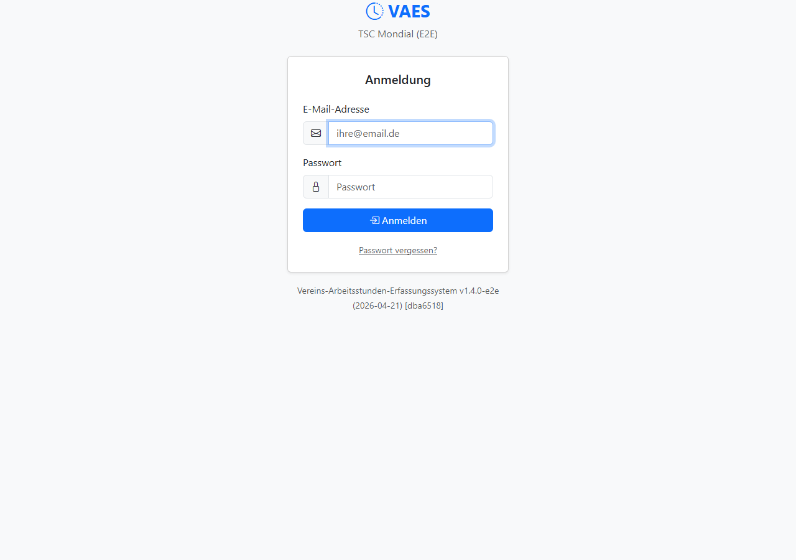

Nach der Ersteinrichtung melden Sie sich kuenftig wie folgt an:

1. Oeffnen Sie die VAES-Anwendung in Ihrem Browser.
2. Geben Sie Ihre **E-Mail-Adresse** und Ihr **Passwort** ein.
3. Klicken Sie auf **"Anmelden"**.
4. Es erscheint die Seite **"Zwei-Faktor-Authentifizierung"**.

**Bei Authenticator-App:**
- Oeffnen Sie die Authenticator-App auf Ihrem Smartphone.
- Lesen Sie den aktuellen 6-stelligen Code fuer den Eintrag **"VAES"** ab.
- Geben Sie den Code in das Feld auf der Webseite ein.
- Klicken Sie auf **"Verifizieren"**.

**Bei E-Mail-Code:**
- Pruefen Sie Ihren E-Mail-Posteingang (auch den Spam-Ordner).
- Sie erhalten eine E-Mail mit dem Betreff **"VAES - Ihr Anmeldecode"**.
- Geben Sie den 6-stelligen Code aus der E-Mail auf der Webseite ein.
- Klicken Sie auf **"Verifizieren"**.
- Der E-Mail-Code ist 10 Minuten gueltig.

**Hinweis zur Kontosperre:** Nach 5 fehlgeschlagenen Anmeldeversuchen wird Ihr Konto voruebergehend fuer 15 Minuten gesperrt. Bei 5 falschen 2FA-Codes muessen Sie den Login-Vorgang komplett neu starten. Diese Werte koennen vom Administrator angepasst werden.

### 2.4 Passwort vergessen

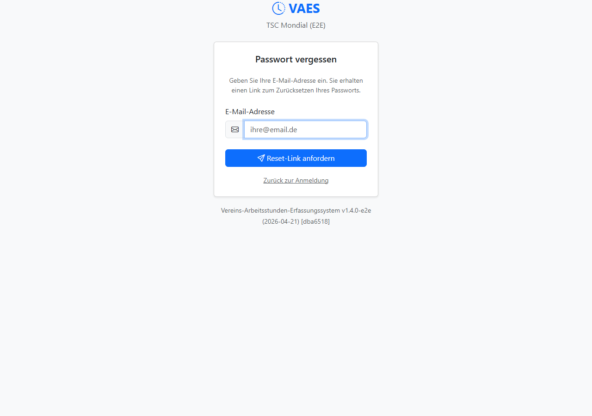

1. Klicken Sie auf der Anmeldeseite auf **"Passwort vergessen?"**
2. Geben Sie Ihre registrierte E-Mail-Adresse ein.
3. Klicken Sie auf **"Reset-Link anfordern"**.
4. Sie erhalten eine E-Mail mit einem Link zum Zuruecksetzen. Dieser Link ist 1 Stunde gueltig.
5. Klicken Sie auf den Link und vergeben Sie ein neues Passwort (gleiche Anforderungen wie bei der Ersteinrichtung).

**Wichtig:** Nach einer Passwortaenderung werden alle aktiven Sitzungen beendet. Sie muessen sich erneut anmelden. Ihre 2FA-Einrichtung bleibt bestehen -- Sie benoetigen weiterhin Ihren 2FA-Code bei der Anmeldung.

**Schutz vor Missbrauch:** Der Passwort-Vergessen-Endpunkt ist durch ein Zwei-Bucket-Rate-Limiting abgesichert. Pro IP-Adresse und pro Ziel-E-Mail-Adresse ist nur eine begrenzte Anzahl Reset-Anfragen pro Zeitfenster moeglich. Die Meldung auf der Webseite ist fuer legitime und missbraeuchliche Anfragen identisch ("Falls die Adresse bekannt ist, wurde eine E-Mail versendet.") -- damit laesst sich ueber diesen Endpunkt nicht herausfinden, welche E-Mail-Adressen im System registriert sind.

### 2.5 Profil und Passwort aendern

Die eigenen Stammdaten (Vorname, Nachname, Adresse, Telefon) werden von der **Mitgliederverwaltung** (Administrator) gepflegt. Moechten Sie Aenderungen anstossen, wenden Sie sich bitte an Ihren Administrator.

**Eigenes Passwort aendern:**

1. Melden Sie sich ab (Benutzermenue rechts oben > **Abmelden**).
2. Auf der Login-Seite auf **"Passwort vergessen?"** klicken.
3. Passwort-Reset-Link per E-Mail anfordern (siehe Abschnitt 2.4).

**2FA-Methode aendern / zuruecksetzen:** Dies erfolgt ebenfalls ueber den Administrator. Dieser kann Ihre 2FA-Konfiguration loeschen, sodass Sie sie bei der naechsten Anmeldung neu einrichten koennen.

---

## 3. Dashboard

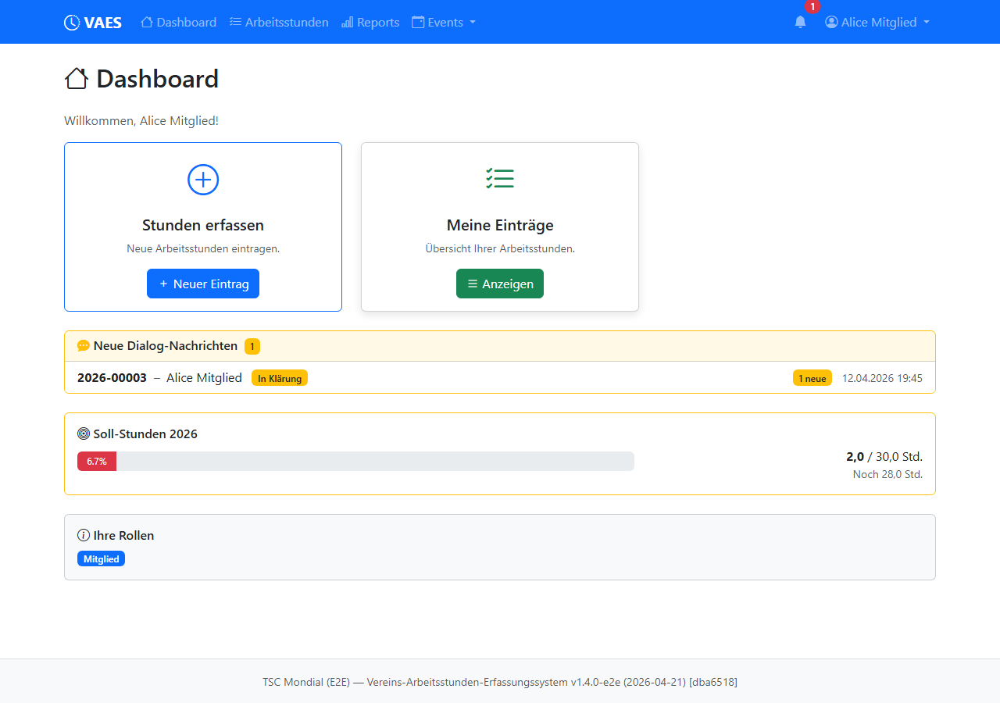

Das Dashboard ist Ihre Startseite nach der Anmeldung. Es bietet einen schnellen Ueberblick und Zugang zu den wichtigsten Funktionen.

### 3.1 Schnellaktionen

Je nach Ihrer Rolle sehen Sie verschiedene Aktionskarten:

| Karte | Sichtbar fuer | Beschreibung |
|-------|---------------|--------------|
| **Stunden erfassen** | Mitglied, Erfasser, Admin | Direkt-Link zum Erstellen eines neuen Eintrags |
| **Meine Eintraege** | Alle | Uebersicht Ihrer eigenen Arbeitsstunden |
| **Events** | Alle | Zugang zur Eventliste und zum Kalender |
| **Antraege pruefen** | Pruefer, Admin | Zugang zur Pruefliste mit Anzahl offener Antraege |
| **Mitglieder** | Admin | Zugang zur Mitgliederverwaltung |

Die Karte **"Antraege pruefen"** zeigt die aktuelle Anzahl offener Antraege als gelbes Badge an. Der Beschreibungstext passt sich dynamisch an: "3 Antraege warten auf Pruefung." bzw. "1 Antrag wartet auf Pruefung." oder "Keine offenen Antraege."

### 3.2 Ungelesene Nachrichten

Wenn neue Dialog-Nachrichten zu Ihren Eintraegen vorliegen, erscheint ein gelb hinterlegter Bereich mit der Aufschrift **Neue Dialog-Nachrichten**. Jede Nachricht zeigt:

- Die Eintragsnummer (z.B. 2026-00012)
- Den Namen des Eintragseigentuemers
- Den aktuellen Status des Eintrags
- Die Anzahl neuer Nachrichten
- Den Zeitpunkt der letzten Nachricht

Klicken Sie auf eine Zeile, um direkt zum betroffenen Eintrag zu gelangen.

**Automatische Aktualisierung:** Das Dashboard prueft alle 60 Sekunden automatisch auf neue Nachrichten und laedt die Seite bei Aenderungen selbststaendig neu.

### 3.3 Soll-Stunden-Fortschritt

Wenn die Soll-Stunden-Funktion vom Administrator aktiviert wurde, zeigt das Dashboard Ihren persoenlichen Fortschritt:

- Ein Fortschrittsbalken zeigt den prozentualen Erfuellungsgrad.
- Die Anzeige zeigt Ist-Stunden / Soll-Stunden (z.B. 12,5 / 20,0 Std.).
- Bei Erfuellung erscheint ein gruenes Badge **Erfuellt**.
- Unterhalb 50% ist der Balken rot, ab 50% gelb, bei Erfuellung gruen.
- Befreite Mitglieder sehen den Hinweis: **Sie sind von den Soll-Stunden befreit.**

**Hinweis:** Nur Eintraege im Status **Freigegeben** werden als Ist-Stunden gezaehlt. Auch automatisch erzeugte Eintraege aus Event-Einsaetzen fliessen nach Freigabe ein (siehe Abschnitt 9.5).

### 3.4 Rollenuebersicht

Am unteren Rand des Dashboards sehen Sie Ihre zugewiesenen Rollen als farbige Badges:

- **Mitglied** (blau)
- **Erfasser** (hellblau)
- **Pruefer** (gelb)
- **Auditor** (grau)
- **Event-Admin** (violett)
- **Administrator** (rot)

---

## 4. Navigation

### 4.1 Hauptnavigation

Die Navigationsleiste am oberen Bildschirmrand zeigt je nach Rolle unterschiedliche Menuepunkte:

**Fuer alle Benutzer:**
- **Dashboard** - Startseite
- **Events** - Event-Uebersicht und Kalender
- **Meine Events** - Eigene Event-Einsaetze
- **Reports** - Auswertungen und Exporte

**Fuer Mitglieder / Erfasser / Admin:**
- **Arbeitsstunden** - Eigene Eintraege verwalten

**Fuer Pruefer / Admin:**
- **Pruefung** - Eingereichte Antraege pruefen

**Fuer Auditoren (ohne Admin-Rolle):**
- **Audit-Trail** - Aenderungsprotokoll einsehen

**Fuer Event-Admins / Administratoren (Dropdown-Menue "Verwaltung"):**
- **Events verwalten** - Veranstaltungen anlegen und pflegen
- **Event-Vorlagen** - Wiederkehrende Veranstaltungen als Vorlage definieren

**Fuer Administratoren (Dropdown-Menue "Verwaltung"):**
- **Mitglieder** - Benutzerverwaltung
- **Kategorien** - Arbeitskategorien verwalten
- **Soll-Stunden** - Soll-Stunden-Ziele verwalten
- **Audit-Trail** - Aenderungsprotokoll
- **Einstellungen** - Systemkonfiguration

**Benutzermenue (rechts):**
- Zeigt Ihren Namen und Ihre Rollen an
- **Abmelden** - Sitzung beenden

### 4.2 Breadcrumb-Navigation

Unterhalb der Hauptnavigation zeigt eine Breadcrumb-Leiste Ihren aktuellen Standort in der Seitenhierarchie. Beispiel:

> Dashboard > Arbeitsstunden > Eintrag 2026-00012

Klicken Sie auf eine uebergeordnete Ebene, um direkt dorthin zu navigieren. Auf dem Dashboard werden keine Breadcrumbs angezeigt, da es die oberste Ebene ist.

### 4.3 Benachrichtigungsglocke

Rechts neben den Navigationspunkten erscheint ein Glockensymbol, wenn ungelesene Dialog-Nachrichten vorliegen. Die Zahl im roten Badge zeigt die Anzahl der Eintraege mit ungelesenen Nachrichten. Ein Klick auf die Glocke fuehrt zum Dashboard.

Die Glocke wird alle 60 Sekunden automatisch aktualisiert, ohne dass Sie die Seite neu laden muessen.

---

## 5. Arbeitsstunden erfassen

### 5.1 Neuen Eintrag erstellen

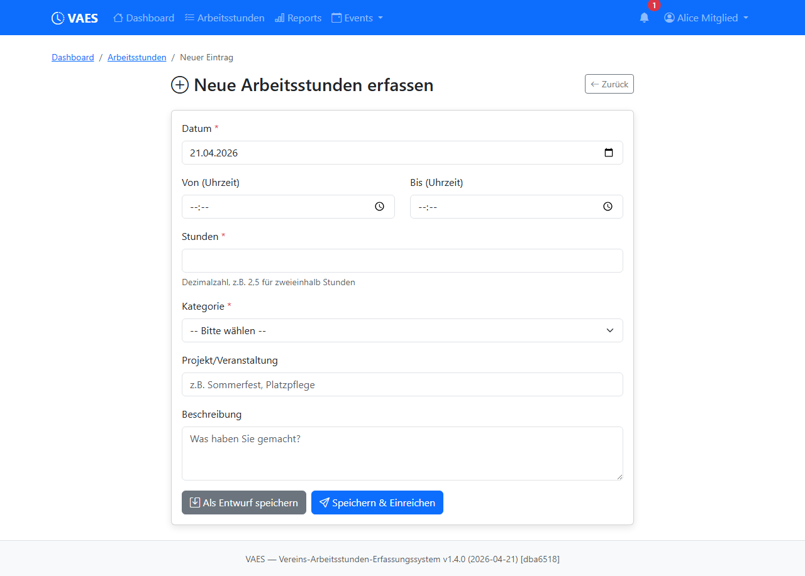

1. Klicken Sie in der Navigation auf **Arbeitsstunden**.
2. Klicken Sie auf den Button **Neuer Eintrag** oder nutzen Sie die Schnellaktion auf dem Dashboard.

Das Erfassungsformular zeigt folgende Felder (je nach Systemkonfiguration koennen einzelne Felder ausgeblendet sein):

| Feld | Beschreibung | Beispiel |
|------|--------------|---------|
| **Datum** | Tag der Arbeit | 15.03.2026 |
| **Uhrzeit von** | Beginn der Arbeit (optional) | 09:00 |
| **Uhrzeit bis** | Ende der Arbeit (optional) | 12:30 |
| **Stunden** | Geleistete Arbeitsstunden (Dezimal) | 3,5 |
| **Kategorie** | Art der Arbeit (Dropdown) | Vereinsheim, Sportplatz, ... |
| **Projekt / Taetigkeit** | Kurze Bezeichnung (optional) | Renovierung Umkleide |
| **Beschreibung** | Detaillierte Beschreibung (optional) | Waende gestrichen, Boden verlegt |

**Hinweise:**
- Felder mit rotem Stern (*) sind Pflichtfelder.
- Bei Uhrzeiten muessen immer beide Felder (Von und Bis) ausgefuellt werden.
- Stunden werden als Dezimalzahl eingegeben (z.B. 1,5 fuer eineinhalb Stunden).
- Maximal 24 Stunden pro Eintrag. Mindestens 0,25 Stunden.
- Sowohl Komma als auch Punkt werden als Dezimaltrennzeichen akzeptiert.

### 5.2 Eintrag als Entwurf speichern

Klicken Sie auf **Als Entwurf speichern**. Der Eintrag wird im Status **Entwurf** gespeichert und kann spaeter bearbeitet oder eingereicht werden.

### 5.3 Eintrag direkt einreichen

Klicken Sie auf **Speichern und einreichen**. Der Eintrag wird gespeichert und sofort zur Pruefung eingereicht (Status: **Eingereicht**). Der Eintrag kann danach nicht mehr bearbeitet, aber zurueckgezogen werden. Die Pruefer erhalten eine E-Mail-Benachrichtigung.

### 5.4 Eintrag bearbeiten

Nur Eintraege im Status **Entwurf** koennen bearbeitet werden.

1. Oeffnen Sie die Eintragsliste unter **Arbeitsstunden**.
2. Klicken Sie auf die Eintragsnummer oder den **Anzeigen**-Button.
3. Klicken Sie auf **Bearbeiten**.
4. Nehmen Sie Ihre Aenderungen vor.
5. Speichern Sie als Entwurf oder reichen Sie direkt ein.

### 5.5 Eintrag loeschen

Nur Eintraege im Status **Entwurf** koennen geloescht werden.

1. Oeffnen Sie die Detailansicht des Eintrags.
2. Klicken Sie auf **Loeschen**.
3. Bestaetigen Sie die Sicherheitsabfrage.

**Hinweis:** Geloeschte Eintraege werden im Hintergrund archiviert (Soft-Delete) und koennen im Audit-Trail nachvollzogen werden.

---

## 6. Meine Eintraege verwalten

### 6.1 Uebersichtsliste

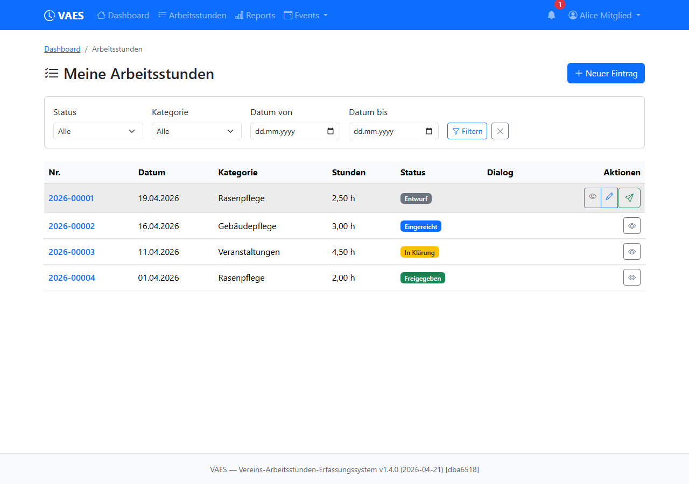

Unter **Arbeitsstunden** sehen Sie eine Tabelle mit allen Ihren Eintraegen:

| Spalte | Beschreibung |
|--------|--------------|
| **Nr.** | Eindeutige Eintragsnummer (z.B. 2026-00012) |
| **Datum** | Arbeitsdatum |
| **Kategorie** | Zugeordnete Arbeitskategorie |
| **Stunden** | Geleistete Stunden (mit Stift-Symbol falls korrigiert) |
| **Status** | Aktueller Status als farbiges Badge |
| **Dialog** | Anzahl offener Rueckfragen (falls vorhanden) |
| **Aktion** | Buttons zur Detailansicht, Bearbeitung, Einreichung |

### 6.2 Filtern und Sortieren

Oberhalb der Tabelle stehen Ihnen Filterfunktionen zur Verfuegung:

- **Status-Filter:** Zeigt nur Eintraege mit dem gewaehlten Status an (Entwurf, Eingereicht, In Klaerung, Freigegeben, Abgelehnt, Storniert).
- **Kategorie-Filter:** Filtert nach Arbeitskategorie.
- **Zeitraum:** Filtert nach Datum (Von / Bis).

Klicken Sie auf **Filtern**, um die Auswahl anzuwenden, oder auf das **X-Symbol**, um alle Filter zu entfernen.

Die Tabelle zeigt standardmaessig 20 Eintraege pro Seite. Bei mehr Eintraegen erscheint eine Seitennavigation am unteren Rand.

### 6.3 Detailansicht

Klicken Sie auf eine Eintragsnummer, um die Detailansicht zu oeffnen. Diese zeigt:

**Linke Spalte:**
- Alle Eintragsdaten (Datum, Uhrzeit, Stunden, Kategorie, Projekt, Beschreibung)
- Korrektur-Informationen (falls der Eintrag korrigiert wurde, mit Original-Stundenzahl)
- Pruefungsinformationen (Pruefer, Datum, ggf. Ablehnungsgrund)
- Rueckfrage-Hinweis bei Status **In Klaerung** (gelber Infokasten)
- Aktions-Buttons je nach Status und Berechtigung

**Rechte Spalte:**
- Dialog-Bereich mit allen Nachrichten (siehe Abschnitt 8)

**Detailansicht im Status Entwurf:**

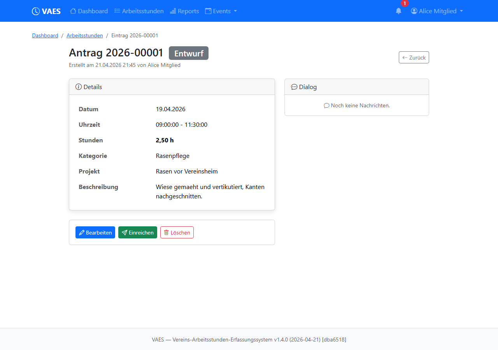

Im Entwurfsstatus koennen Sie den Eintrag bearbeiten, loeschen oder einreichen. Der Dialog-Bereich ist noch leer.

**Detailansicht im Status Eingereicht:**

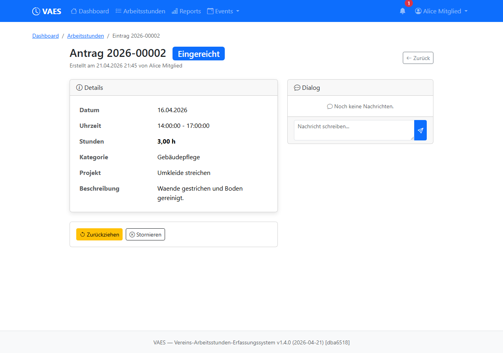

Nach dem Einreichen ist der Eintrag fuer Sie nicht mehr bearbeitbar. Sie koennen ihn zurueckziehen, stornieren oder Nachrichten an den Pruefer senden.

**Detailansicht im Status Freigegeben:**

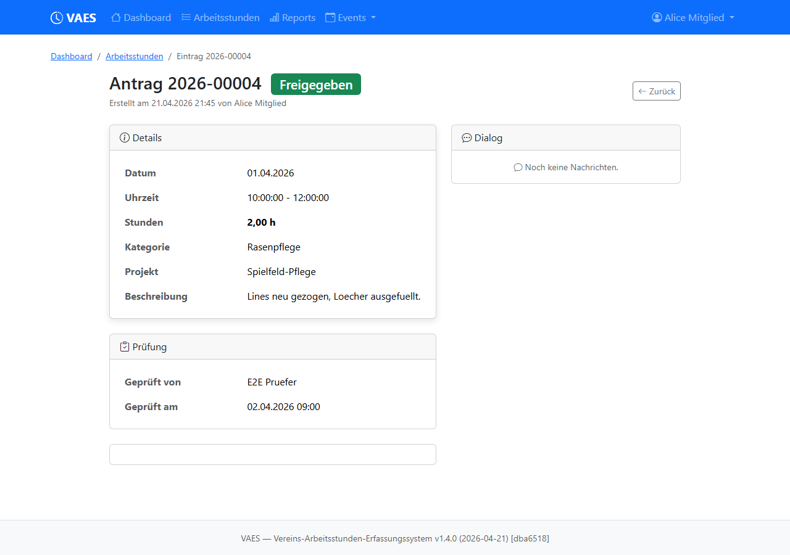

Im Endstatus "Freigegeben" wird der Eintrag in der Soll-Stunden-Summe gezaehlt. Der Dialog-Verlauf bleibt lesbar, neue Nachrichten sind jedoch nicht mehr moeglich.

---

## 7. Freigabe-Workflow

### 7.1 Status-Uebersicht

Jeder Eintrag durchlaeuft einen definierten Workflow mit folgenden Status:

| Status | Badge-Farbe | Beschreibung |
|--------|-------------|--------------|
| **Entwurf** | Grau | Eintrag ist noch in Bearbeitung, nicht eingereicht |
| **Eingereicht** | Blau | Eintrag wurde zur Pruefung eingereicht |
| **In Klaerung** | Gelb | Pruefer hat eine Rueckfrage gestellt |
| **Freigegeben** | Gruen | Eintrag wurde genehmigt (Endstatus) |
| **Abgelehnt** | Rot | Eintrag wurde abgelehnt (Endstatus) |
| **Storniert** | Dunkel | Eintrag wurde vom Mitglied storniert |

### 7.2 Eintrag einreichen

**Voraussetzung:** Eintrag im Status **Entwurf**.

- In der Detailansicht: Klicken Sie auf **Einreichen**.
- Beim Erstellen: Klicken Sie auf **Speichern und einreichen**.

Nach dem Einreichen koennen alle Pruefer den Eintrag sehen und bearbeiten. Die Pruefer erhalten eine E-Mail-Benachrichtigung.

### 7.3 Eintrag zurueckziehen

**Voraussetzung:** Eintrag im Status **Eingereicht** oder **In Klaerung**.

1. Oeffnen Sie die Detailansicht.
2. Klicken Sie auf **Zurueckziehen**.
3. Bestaetigen Sie die Sicherheitsabfrage.

Der Eintrag geht zurueck in den Status **Entwurf** und kann bearbeitet und erneut eingereicht werden.

### 7.4 Eintrag stornieren

**Voraussetzung:** Eintrag im Status **Eingereicht** oder **In Klaerung**.

1. Oeffnen Sie die Detailansicht.
2. Klicken Sie auf **Stornieren**.
3. Bestaetigen Sie die Sicherheitsabfrage.

Stornierte Eintraege werden nicht gewertet, koennen aber reaktiviert werden.

### 7.5 Stornierten Eintrag reaktivieren

**Voraussetzung:** Eintrag im Status **Storniert**.

1. Oeffnen Sie die Detailansicht.
2. Klicken Sie auf **Reaktivieren**.

Der Eintrag geht zurueck in den Status **Entwurf**.

### 7.6 Workflow-Diagramm

```
                          ┌──────────────┐
                          │   Entwurf    │
                          └──────┬───────┘
                                 │ Einreichen
                                 v
                          ┌──────────────┐
              ┌───────────│ Eingereicht  │───────────┐
              │           └──────┬───────┘           │
              │ Zurueckziehen    │                   │ Stornieren
              │                  │                   │
              v                  v                   v
       ┌──────────┐    ┌──────────────┐     ┌────────────┐
       │ Entwurf  │    │ In Klaerung  │     │ Storniert  │
       └──────────┘    └──────┬───────┘     └─────┬──────┘
                              │                   │ Reaktivieren
              ┌───────────────┼───────────┐       │
              │               │           │       v
              v               v           v    ┌──────────┐
       ┌────────────┐ ┌────────────┐ ┌────────│ Entwurf  │
       │Freigegeben │ │ Abgelehnt  │ │Entwurf │└──────────┘
       └────────────┘ └────────────┘ └────────┘
        (Endstatus)    (Endstatus)
```

**Moegliche Uebergaenge im Detail:**

| Von | Nach | Aktion | Wer |
|-----|------|--------|-----|
| Entwurf | Eingereicht | Einreichen | Eigentuemer |
| Eingereicht | Freigegeben | Freigeben | Pruefer |
| Eingereicht | In Klaerung | Rueckfrage | Pruefer |
| Eingereicht | Abgelehnt | Ablehnen | Pruefer |
| Eingereicht | Entwurf | Zurueckziehen | Eigentuemer |
| Eingereicht | Storniert | Stornieren | Eigentuemer |
| In Klaerung | Freigegeben | Freigeben | Pruefer |
| In Klaerung | Abgelehnt | Ablehnen | Pruefer |
| In Klaerung | Entwurf | Zurueckziehen | Eigentuemer |
| In Klaerung | Storniert | Stornieren | Eigentuemer |
| Storniert | Entwurf | Reaktivieren | Eigentuemer |

---

## 8. Dialog-System

Das Dialog-System ermoeglicht die direkte Kommunikation zwischen Mitglied und Pruefer innerhalb eines Eintrags.

### 8.1 Nachrichten lesen

Der Dialog-Bereich befindet sich in der rechten Spalte der Detailansicht. Nachrichten werden chronologisch als Chat-artige Sprechblasen angezeigt:

- **Eigene Nachrichten:** Blauer Hintergrund, rechtsbuendig.
- **Nachrichten anderer:** Grauer Hintergrund, linksbuendig.
- **Offene Rueckfragen:** Gelber Hintergrund mit Fragezeichen-Symbol.
- **Beantwortete Rueckfragen:** Fragezeichen- und Haekchen-Symbol.

Jede Nachricht zeigt den Absendernamen und den Zeitstempel.

### 8.2 Nachricht senden

Nachrichten koennen nur bei Eintraegen im Status **Eingereicht** oder **In Klaerung** gesendet werden.

1. Geben Sie Ihre Nachricht in das Textfeld am unteren Rand des Dialog-Bereichs ein.
2. Klicken Sie auf den Senden-Button (Pfeil-Symbol).

Die Gegenseite (Pruefer oder Mitglied) erhaelt eine E-Mail-Benachrichtigung ueber die neue Nachricht.

### 8.3 Rueckfragen und Antworten

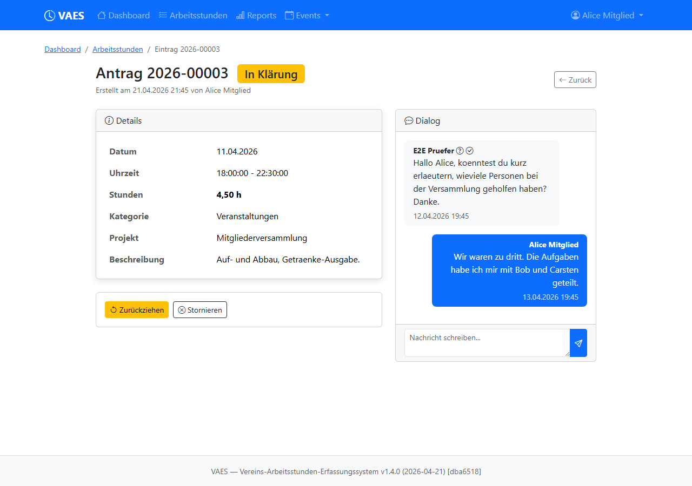

Wenn ein Pruefer eine Rueckfrage stellt, aendert sich der Status des Eintrags auf **In Klaerung**. Die Rueckfrage erscheint im Dialog-Bereich mit gelbem Hintergrund.

**Als Mitglied antworten:**
1. Oeffnen Sie den Eintrag.
2. Lesen Sie die Rueckfrage im Dialog-Bereich.
3. Schreiben Sie Ihre Antwort im Textfeld.
4. Klicken Sie auf Senden.

Sobald Sie antworten, wird die Rueckfrage automatisch als beantwortet markiert.

### 8.4 Benachrichtigungen

Ungelesene Dialog-Nachrichten werden an mehreren Stellen angezeigt:

- **Glocken-Badge** in der Navigation (alle Seiten)
- **Nachrichten-Bereich** auf dem Dashboard
- **Dialog-Badge** in der Eintragsliste

Sobald Sie einen Eintrag oeffnen, werden dessen Nachrichten als gelesen markiert.

---

## 9. Events und Veranstaltungen

Mit dem Event-Modul koennen Helfer-Einsaetze fuer Veranstaltungen zentral geplant und uebernommen werden. Organisatoren legen Events mit einzelnen Aufgaben an; Mitglieder sehen offene Aufgaben und koennen sich selbst eintragen. Nach Abschluss des Events werden die geleisteten Stunden automatisch als Arbeitsstunden-Eintrag erzeugt.

### 9.1 Eventliste

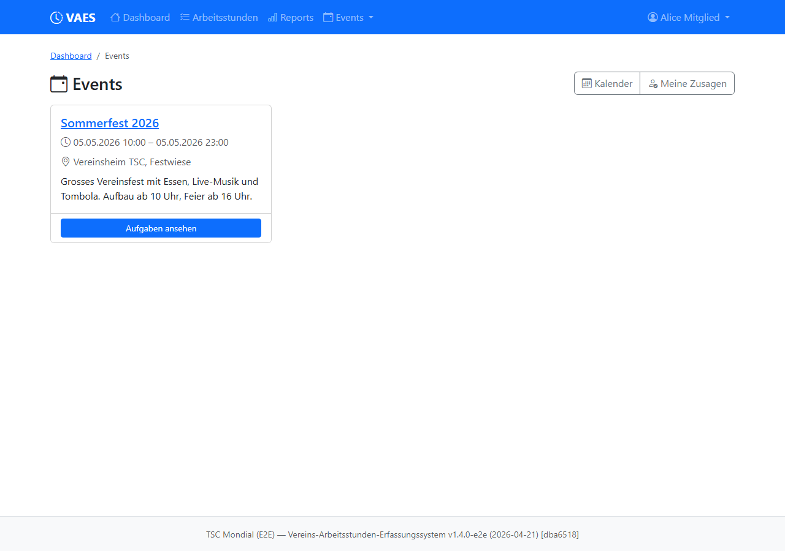

Erreichbar ueber **Events** in der Navigation. Die Liste zeigt anstehende und vergangene Veranstaltungen mit:

- Titel und Datum
- Ort (falls hinterlegt)
- Kurzbeschreibung
- Status-Badge (Geplant, Laufend, Abgeschlossen, Abgesagt)
- Anzahl offener / besetzter Aufgaben

**Filter:**
- Zeitraum (Von / Bis)
- Status (Nur zukuenftige / Alle)
- Textsuche (Titel, Ort)

Klicken Sie auf einen Event-Titel, um die Detailansicht zu oeffnen.

### 9.2 Kalenderansicht

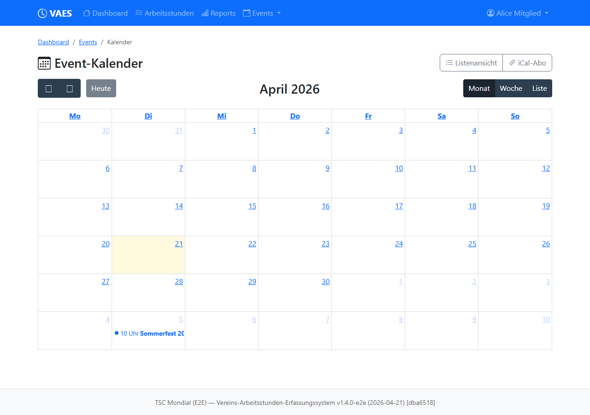

Ueber den Button **Kalender** (oder direkt den Navigationspunkt) erreichen Sie eine Monatsuebersicht aller Events. Jedes Event erscheint als farbig markierter Eintrag am betreffenden Tag. Ein Klick auf den Eintrag oeffnet die Detailansicht des Events.

Der Kalender laesst sich monatsweise vor- und zurueckblaettern. Heutige Events sind farblich hervorgehoben.

### 9.3 Event-Details und Aufgaben uebernehmen

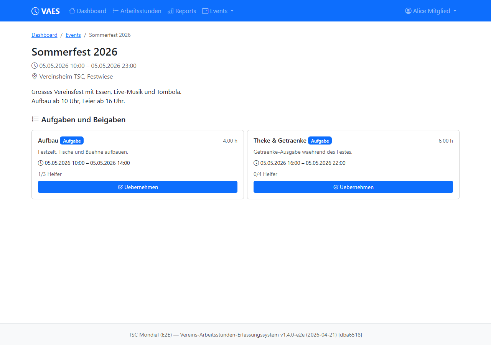

Die Detailansicht eines Events zeigt:

**Linke Spalte:**
- Titel, Datum, Start-/Endzeit, Ort
- Vollstaendige Beschreibung
- Status des Events

**Rechte Spalte (Aufgabenliste):**
- Alle Aufgaben mit Name, benoetigten Helfern und Stunden pro Helfer
- Bereits belegte Plaetze (mit Namen der Helfer, soweit Sichtbarkeit konfiguriert)
- Freie Plaetze als Schaltflaeche **Aufgabe uebernehmen**

**Hierarchische Aufgabenansicht (optional, ab VAES 1.4.1)**

Hat der Event-Administrator die Aufgaben eines Events in eine
Baumstruktur gegliedert (z.B. *Thekendienst > Essensausgabe >
Nachmittagsschicht*), rendert die Event-Detailseite keinen Karten-
Block mehr, sondern eine aufklappbare Baumansicht (HTML-
`<details>`-Elemente, ohne JavaScript bedienbar).

- **Gruppen aufklappen / zuklappen:** Klick auf den Gruppen-Titel,
  Enter- oder Leertaste bei Tastatur-Fokus. Gruppen, in denen es
  noch offene Plaetze gibt, sind beim Laden automatisch aufgeklappt;
  voll belegte Gruppen starten eingeklappt, sind aber manuell
  oeffenbar.
- **Offen-Badge:** Neben jedem Gruppen-Titel steht die Zahl der
  offenen Plaetze im gesamten Teilbaum (z.B. `3 offen`). Voll
  belegte Gruppen bekommen ein `voll`-Badge.
- **Filter "Nur offene Plaetze anzeigen":** Der Schalter oben an
  der Baumansicht blendet voll belegte Leaves und Gruppen per CSS
  aus. Sind nach dem Filtern keine Aufgaben mehr uebrig, erscheint
  ein Hinweis *"Aktuell keine offenen Plaetze verfuegbar."*. Der
  Filter ist rein clientseitig — kein Seiten-Reload, keine
  Speicherung zwischen Browser-Sessions. Standard ist der Filter
  aus (alle Aufgaben sichtbar).
- **Aufgabe uebernehmen / Status:** Jeder Leaf (konkrete Aufgabe)
  zeigt denselben Uebernehmen-Button wie die Karten-Ansicht. Flow
  und Rueckgabe (*"Bereits zugesagt"*, *"Ausgebucht"*) sind 1:1
  gleich — die Hierarchie aendert nur die Darstellung, nicht das
  Verhalten.

Der Administrator kann die Baumansicht jederzeit deaktivieren; das
Event faellt dann auf die flache Karten-Ansicht zurueck. Ist kein
Baumstruktur-Editor eingeschaltet oder hat das Event nur Top-Level-
Aufgaben ohne Gruppen, erscheint weiterhin die flache Karten-Ansicht
wie oben beschrieben.

**Aufgabe uebernehmen:**
1. Klicken Sie bei einer Aufgabe mit freien Plaetzen auf **Aufgabe uebernehmen**.
2. Bestaetigen Sie die Sicherheitsabfrage.
3. Sie erscheinen in der Teilnehmerliste der Aufgabe. Unter **Meine Events** (siehe 9.4) sehen Sie nun Ihren Einsatz.

**Eigene Zuweisung zuruecknehmen:**
- Solange das Event nicht abgeschlossen ist, koennen Sie Ihren Platz wieder freigeben (Button **Zuweisung entfernen** in der Aufgabe).
- Nach Abschluss des Events ist eine Ruecknahme nur durch den Organisator oder Admin moeglich.

**Ersatz-Vorschlag:** Falls Sie kurzfristig verhindert sind, koennen Sie alternativ einen **Ersatz-Vorschlag** abgeben (Button **Ersatz vorschlagen**). Der Organisator erhaelt eine Benachrichtigung und kann die Umwidmung bestaetigen.

### 9.4 Meine Events

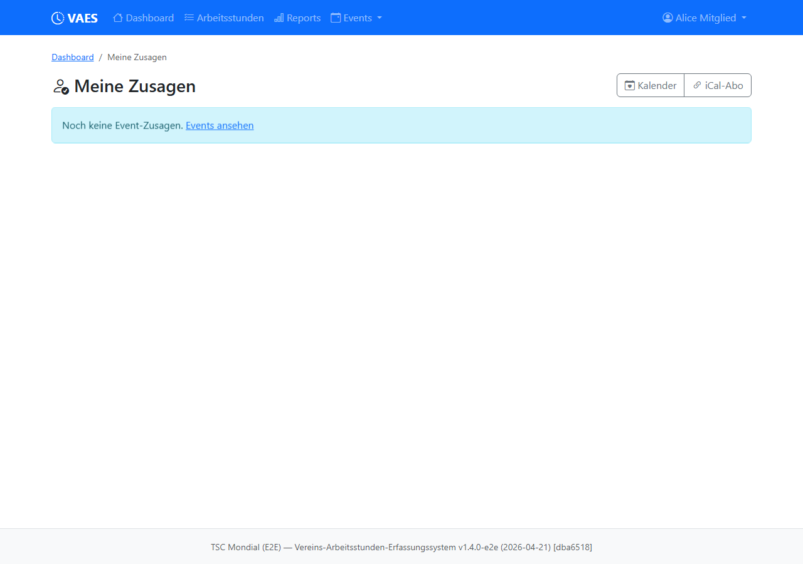

Unter **Meine Events** sehen Sie ausschliesslich Veranstaltungen, bei denen Sie eine Aufgabe uebernommen haben. Die Liste ist chronologisch sortiert (aelteste offene Aufgabe oben) und zeigt:

- Event-Titel und Datum
- Ihre zugewiesene Aufgabe
- Start-/Endzeit Ihrer Aufgabe
- Status (Geplant, Absolviert, Abgesagt)

**Tipp:** Aus dieser Ansicht koennen Sie direkt in die Event-Details springen oder Ihre Zuweisung zuruecknehmen, solange das Event noch nicht abgeschlossen ist.

### 9.5 Automatische Arbeitsstunden aus Events

Sobald ein Event den Status **Abgeschlossen** erhaelt, erzeugt das System automatisch fuer jede zugewiesene Aufgabe einen Arbeitsstunden-Eintrag:

- **Eigentuemer:** Der zugewiesene Helfer
- **Datum / Uhrzeit:** Uebernommen aus Event bzw. Aufgabe
- **Stunden:** Aus der Aufgaben-Definition
- **Kategorie:** Die vom Organisator gewaehlte Standard-Kategorie
- **Projekt:** Event-Titel
- **Beschreibung:** Aufgaben-Bezeichnung (z.B. "Theke & Getraenke")
- **Status:** Automatisch **Eingereicht** (springt direkt in den Freigabe-Workflow)
- **Markierung:** Der Eintrag ist als "Event-Herkunft" gekennzeichnet. In der Detailansicht sehen Sie den Verweis auf das Event.

Die Stunden zaehlen nach Freigabe normal auf Ihre Soll-Stunden.

**Korrekturen:** Moechten Sie die automatisch erzeugten Stunden korrigieren (z.B. weil der Einsatz kuerzer war), wenden Sie sich bitte an den Pruefer. Dieser kann die Stunden ueber die Korrektur-Funktion anpassen (siehe Abschnitt 11.5).

### 9.6 iCal-Abonnement (Kalender-Integration)

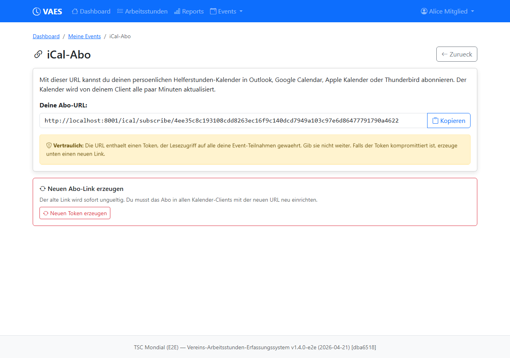

Ueber ein iCal-Abonnement koennen Sie Ihre Event-Einsaetze automatisch in Ihrem privaten Kalender (Outlook, Apple Kalender, Google Kalender, Thunderbird) anzeigen lassen. Der Kalender aktualisiert sich automatisch, wenn sich Zuweisungen aendern.

**iCal-Link abrufen:**

1. Oeffnen Sie **Meine Events**.
2. Klicken Sie auf **Kalender-Abo einrichten**.
3. Es erscheint eine Abonnement-URL, die einen persoenlichen Zugriffs-Token enthaelt. Kopieren Sie die URL.

**Abonnement einrichten:**

| Programm | Vorgehen |
|----------|----------|
| **Apple Kalender (macOS / iOS)** | Datei > Neues Kalenderabonnement > URL einfuegen > Ok |
| **Outlook (Web)** | Kalender > Kalender hinzufuegen > Aus dem Internet abonnieren > URL einfuegen |
| **Outlook (Desktop)** | Kalender > Kalender hinzufuegen > Aus dem Internet > URL einfuegen |
| **Google Kalender** | Weitere Kalender (+ Symbol) > Per URL > URL einfuegen |
| **Thunderbird** | Kalender > Neu > Im Netzwerk > iCalendar (ICS) > URL einfuegen |

**Sicherheit des Tokens:**

- Der Token in der URL identifiziert Sie gegenueber dem System. Behandeln Sie ihn wie ein Passwort.
- Geben Sie die URL nicht weiter. Jeder, der die URL kennt, sieht Ihre Einsaetze.
- Bei Verdacht auf Missbrauch koennen Sie ueber die Schaltflaeche **Token zuruecksetzen** einen neuen Token erzeugen. Alle bestehenden Abonnements werden damit ungueltig und muessen mit der neuen URL erneut angelegt werden.

**Aktualisierungszyklus:** Kalender-Programme rufen das Abo im Schnitt alle 15 Minuten bis 3 Stunden ab (je nach Anbieter). Manuelles Aktualisieren ist meist ebenfalls moeglich.

---

## 10. Reports und Exporte

### 10.1 Report-Seite

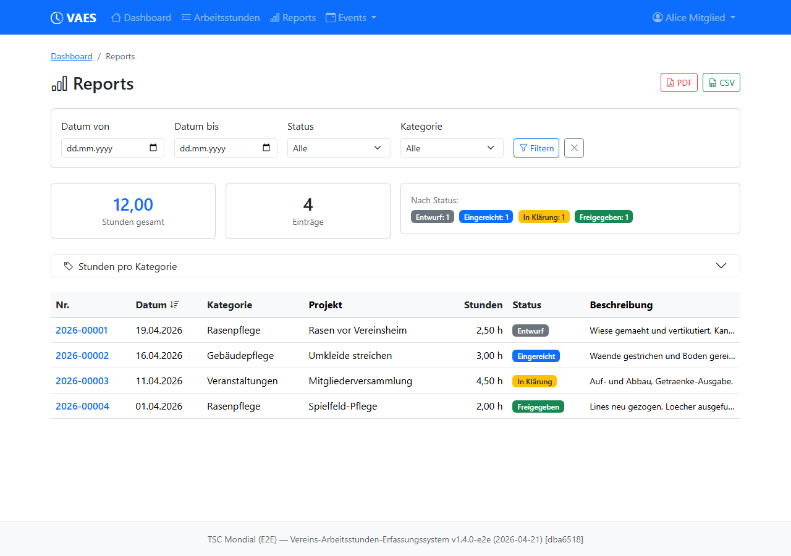

Die Report-Seite erreichen Sie ueber **Reports** in der Navigation. Sie zeigt eine umfassende Auswertung Ihrer Arbeitsstunden (Pruefer und Administratoren sehen alle Mitglieder).

### 10.2 Filter verwenden

Folgende Filter stehen zur Verfuegung:

| Filter | Beschreibung |
|--------|--------------|
| **Zeitraum** | Datum von / bis |
| **Status** | Eintragsstatus filtern |
| **Kategorie** | Nach Arbeitskategorie filtern |
| **Mitglied** | Nach einzelnem Mitglied filtern (nur fuer Pruefer/Admin) |

Klicken Sie auf **Filtern**, um die Auswahl anzuwenden.

### 10.3 Zusammenfassung

Oberhalb der Tabelle zeigt der Report Zusammenfassungskarten:

- **Gesamtstunden** - Summe aller gefilterten Stunden
- **Anzahl Eintraege** - Gesamtzahl der Eintraege
- **Status-Verteilung** - Aufschluesselung nach Status

Zusaetzlich sind aufklappbare Bereiche verfuegbar:
- **Stunden nach Kategorie** - Aufsummiert pro Arbeitskategorie
- **Stunden nach Mitglied** - Aufsummiert pro Person (nur fuer Pruefer/Admin)

**Admin-/Pruefer-Sicht:**

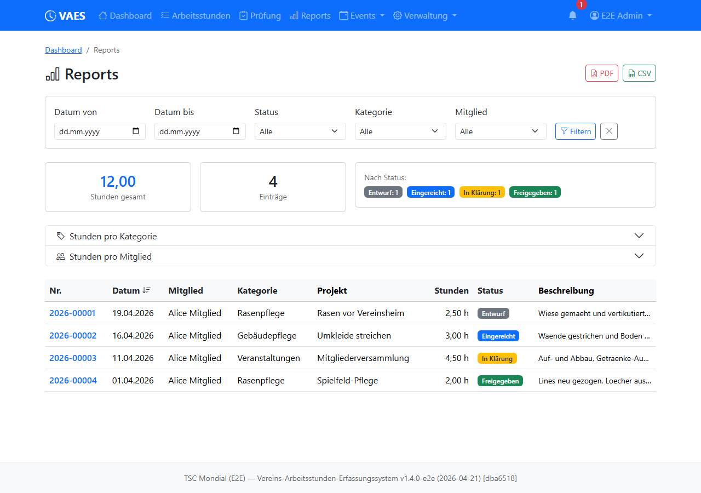

In der erweiterten Ansicht (Pruefer, Auditor, Admin) stehen zusaetzlich Mitglieder-bezogene Filter und Aggregationen zur Verfuegung.

### 10.4 PDF-Export

1. Setzen Sie die gewuenschten Filter.
2. Klicken Sie auf den roten Button **PDF**.
3. Die PDF-Datei wird automatisch heruntergeladen.

Die PDF enthaelt:
- Angewandte Filter als Kopfzeile
- Zusammenfassung (Stunden, Eintraege, Status)
- Vollstaendige Tabelle aller gefilterten Eintraege
- Erstellungsdatum und Benutzername

### 10.5 CSV-Export

1. Setzen Sie die gewuenschten Filter.
2. Klicken Sie auf den gruenen Button **CSV**.
3. Die CSV-Datei wird automatisch heruntergeladen.

Die CSV-Datei kann in Tabellenkalkulationsprogrammen (Excel, LibreOffice Calc) geoeffnet werden. Die Zeichenkodierung ist UTF-8.

**Hinweis:** Alle Exporte werden im Audit-Trail protokolliert.

---

## 11. Pruefer-Funktionen

Dieser Abschnitt beschreibt Funktionen, die nur fuer Benutzer mit der Rolle **Pruefer** oder **Administrator** verfuegbar sind.

### 11.1 Pruefliste

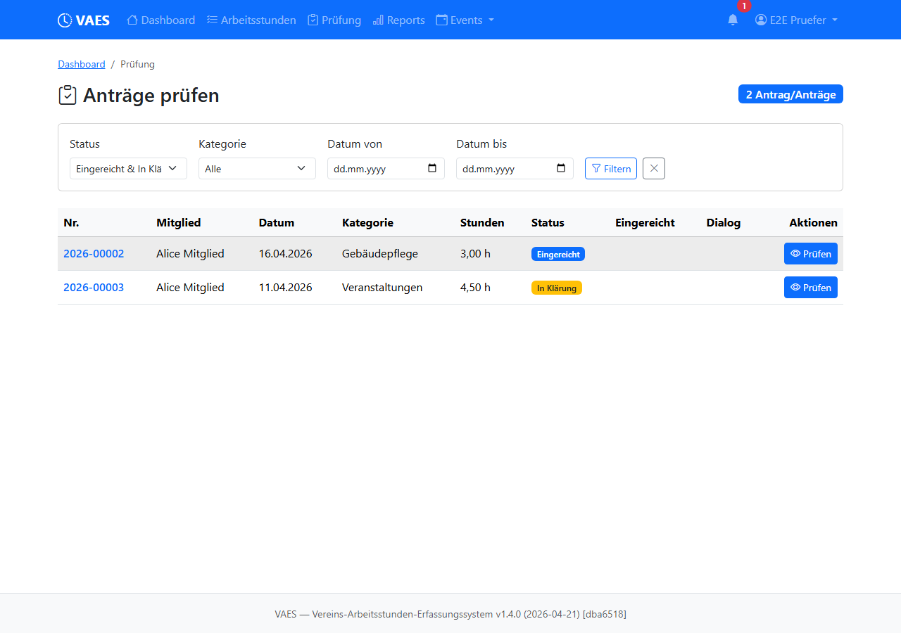

Unter **Pruefung** in der Navigation sehen Sie alle eingereichten Eintraege anderer Mitglieder. Eigene Eintraege erscheinen hier nicht (Selbstgenehmigung ist nicht erlaubt).

Die Tabelle zeigt:

| Spalte | Beschreibung |
|--------|--------------|
| **Nr.** | Eintragsnummer |
| **Mitglied** | Name des Eintragseigentuemers |
| **Datum** | Arbeitsdatum |
| **Kategorie** | Arbeitskategorie |
| **Stunden** | Geleistete Stunden |
| **Status** | Eingereicht oder In Klaerung |
| **Eingereicht am** | Zeitpunkt der Einreichung |
| **Dialog** | Anzahl offener Rueckfragen |
| **Aktion** | Button "Pruefen" zum Oeffnen |

Die Liste kann nach Status, Kategorie und Zeitraum gefiltert werden. Standardmaessig werden Eintraege nach Einreichungsdatum sortiert (aelteste zuerst).

### 11.2 Eintrag freigeben

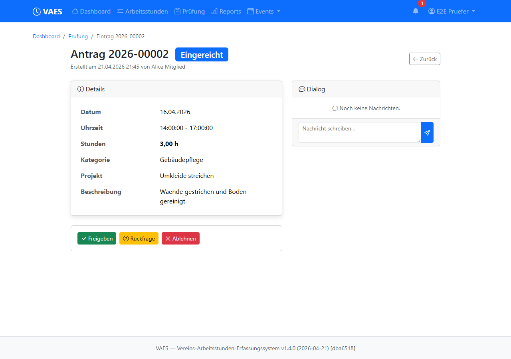

1. Klicken Sie in der Pruefliste auf **Pruefen** beim gewuenschten Eintrag.
2. Pruefen Sie die Details und den Dialog-Verlauf.
3. Klicken Sie auf den gruenen Button **Freigeben**.
4. Bestaetigen Sie die Sicherheitsabfrage.

Der Eigentuemer erhaelt eine E-Mail-Benachrichtigung. Der Eintrag erreicht den Endstatus **Freigegeben**.

### 11.3 Rueckfrage stellen

1. Oeffnen Sie den Eintrag ueber die Pruefliste.
2. Klicken Sie auf den gelben Button **Rueckfrage**.
3. Es oeffnet sich ein Dialog-Fenster. Geben Sie Ihre Frage oder den Klaerungsbedarf ein (Pflichtfeld).
4. Klicken Sie auf **Rueckfrage senden**.

Der Eintrag wechselt in den Status **In Klaerung**. Der Eigentuemer erhaelt eine E-Mail und sieht die Rueckfrage im Dialog-Bereich.

### 11.4 Eintrag ablehnen

1. Oeffnen Sie den Eintrag ueber die Pruefliste.
2. Klicken Sie auf den roten Button **Ablehnen**.
3. Es oeffnet sich ein Dialog-Fenster. Geben Sie eine Begruendung ein (Pflichtfeld).
4. Klicken Sie auf **Ablehnen**.

Der Eigentuemer erhaelt eine E-Mail-Benachrichtigung. Der Eintrag erreicht den Endstatus **Abgelehnt**.

### 11.5 Stunden korrigieren

Bereits freigegebene Eintraege koennen nachtraeglich korrigiert werden (z.B. bei Fehlern in der Stundenanzahl).

1. Oeffnen Sie einen freigegebenen Eintrag.
2. Klicken Sie auf **Korrektur**.
3. Es oeffnet sich ein Dialog-Fenster mit den aktuellen Stunden (nicht aenderbar) und einem Feld fuer die neuen Stunden.
4. Geben Sie die **neuen Stunden** ein (0,25 bis 24, in 0,25er-Schritten).
5. Geben Sie eine **Begruendung** ein (Pflichtfeld).
6. Klicken Sie auf **Korrektur speichern**.

Die urspruengliche Stundenzahl bleibt im System gespeichert und wird in der Detailansicht als "Korrigiert (vorher: X h)" angezeigt. Die Korrektur wird vollstaendig im Audit-Trail protokolliert. Der Eigentuemer erhaelt eine E-Mail-Benachrichtigung mit den alten und neuen Stunden.

### 11.6 Wichtige Regel: Keine Selbstgenehmigung

Ein Pruefer kann **niemals** eigene Eintraege freigeben, ablehnen oder mit einer Rueckfrage versehen. Diese Regel gilt auch fuer Administratoren. Wenn ein Pruefer selbst Arbeitsstunden einreicht, muss ein anderer Pruefer diese genehmigen.

Ebenso koennen Eintraege, die ein Pruefer in der Rolle **Erfasser** fuer andere erstellt hat, nicht von demselben Pruefer genehmigt werden.

---

## 12. Administration

Dieser Abschnitt beschreibt Funktionen, die nur fuer Benutzer mit der Rolle **Administrator** (bzw. in Teilen **Event-Admin**) verfuegbar sind.

### 12.1 Mitgliederverwaltung

Erreichbar ueber **Verwaltung > Mitglieder**.

#### Mitglieder-Liste

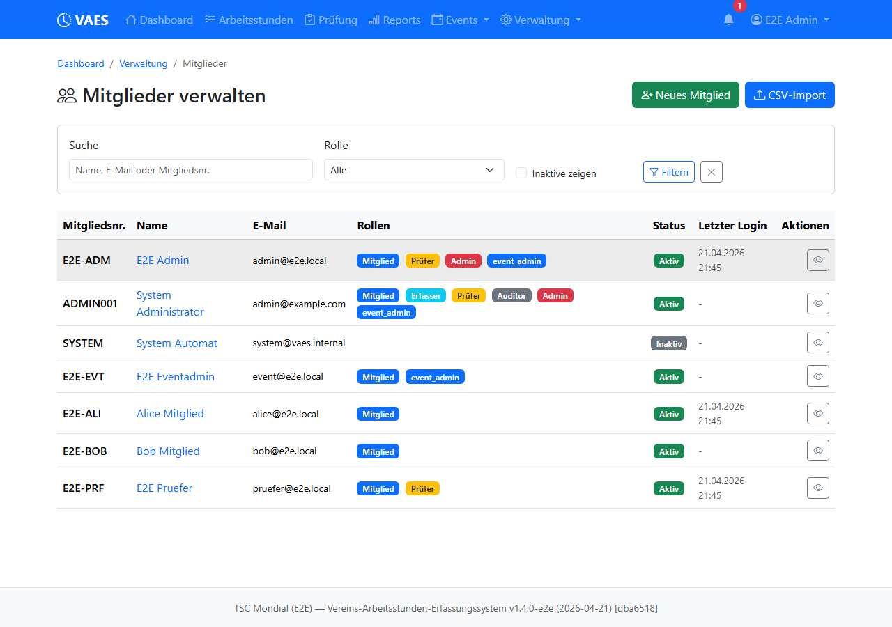

Die Uebersicht zeigt alle Mitglieder mit:
- Mitgliedsnummer, Name, E-Mail-Adresse
- Zugewiesene Rollen (als farbige Badges)
- Status: Aktiv (gruen), Inaktiv (grau), Einladung offen (gelb), Geloescht (rot)
- Letzter Login

**Filter:**
- Textsuche (Name, E-Mail, Mitgliedsnummer)
- Rollenfilter
- Checkbox: Inaktive Mitglieder anzeigen

#### Neues Mitglied anlegen

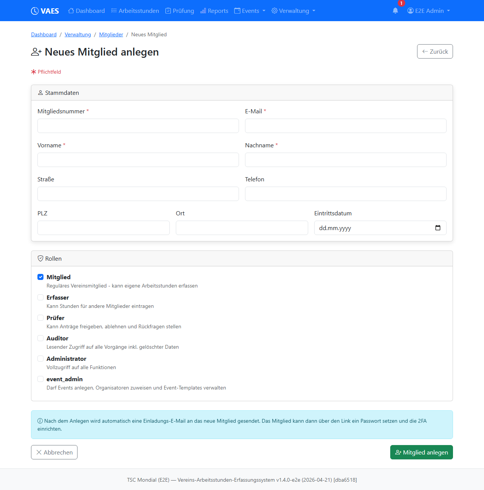

1. Klicken Sie auf **Neues Mitglied**.
2. Fuellen Sie die Stammdaten aus:
   - **Mitgliedsnummer** (Pflicht, eindeutig)
   - **E-Mail** (Pflicht, eindeutig)
   - **Vorname** (Pflicht)
   - **Nachname** (Pflicht)
   - Strasse, PLZ, Ort, Telefon (optional)
   - Eintrittsdatum (optional)
3. Waehlen Sie die Rollen (Standard: Mitglied ist vorausgewaehlt).
4. Klicken Sie auf **Mitglied anlegen**.

Das Mitglied erhaelt automatisch eine Einladungs-E-Mail mit einem Link zum Setzen des Passworts und anschliessender 2FA-Einrichtung.

#### CSV-Import

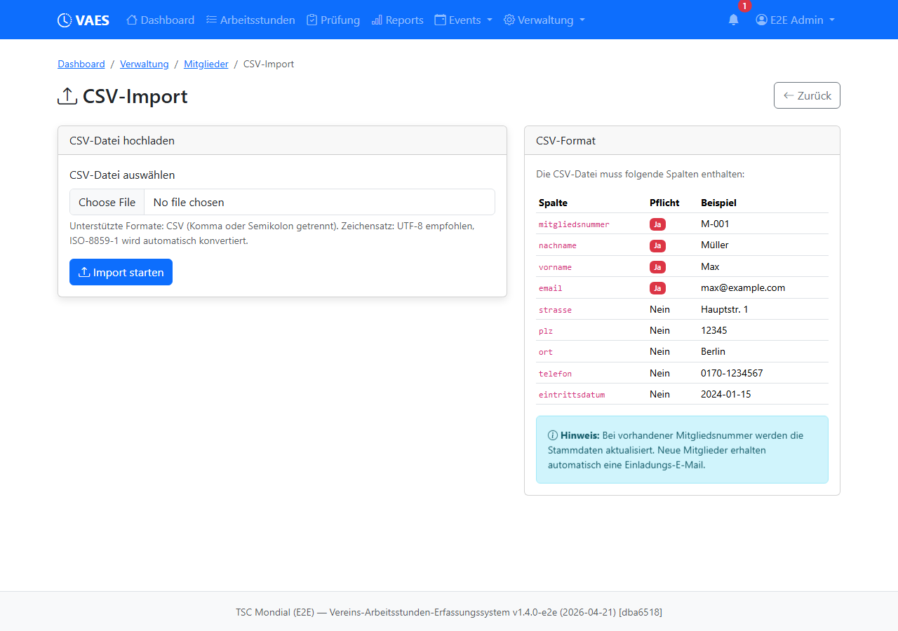

Fuer die Anlage mehrerer Mitglieder gleichzeitig:

1. Klicken Sie auf **CSV-Import**.
2. Laden Sie eine CSV-Datei mit folgenden Spalten hoch:
   - Pflicht: mitgliedsnummer, nachname, vorname, email
   - Optional: strasse, plz, ort, telefon, eintrittsdatum
3. Klicken Sie auf **Import starten**.
4. Pruefen Sie das Import-Ergebnis (Erfolgreich / Uebersprungen / Fehler).

Importierte Mitglieder erhalten automatisch die Rolle **Mitglied** und eine Einladungs-E-Mail.

#### Mitglied bearbeiten

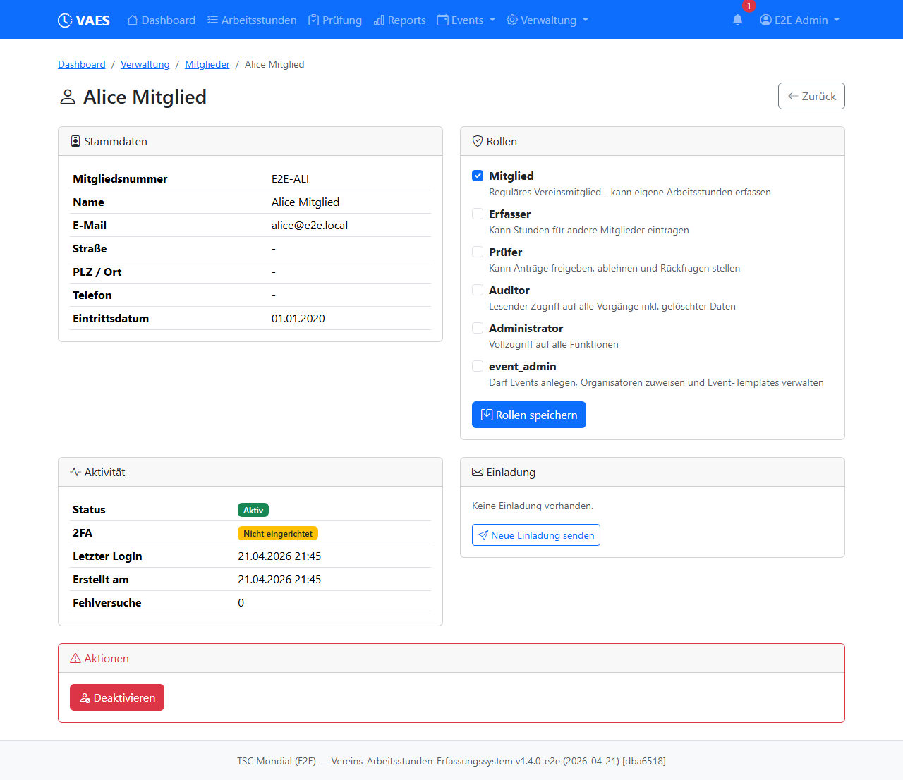

In der Detailansicht eines Mitglieds koennen Sie:

- **Rollen aendern:** Haekchen bei den gewuenschten Rollen setzen und speichern.
- **Neue Einladung senden:** Falls die erste Einladung abgelaufen ist.
- **Mitglied deaktivieren:** Das Mitglied kann sich nicht mehr anmelden. Bestehende Daten bleiben erhalten.
- **Mitglied reaktivieren:** Ein deaktiviertes Mitglied wieder freischalten.
- **2FA zuruecksetzen:** Loescht die 2FA-Einrichtung des Mitglieds (Nutzer muss sie bei naechster Anmeldung neu einrichten).

Die Detailansicht zeigt ausserdem den 2FA-Status (TOTP / E-Mail / Nicht eingerichtet), die Anzahl fehlgeschlagener Anmeldeversuche und ob das Konto gesperrt ist.

**Hinweis:** Sie koennen sich nicht selbst deaktivieren.

### 12.2 Kategorien verwalten

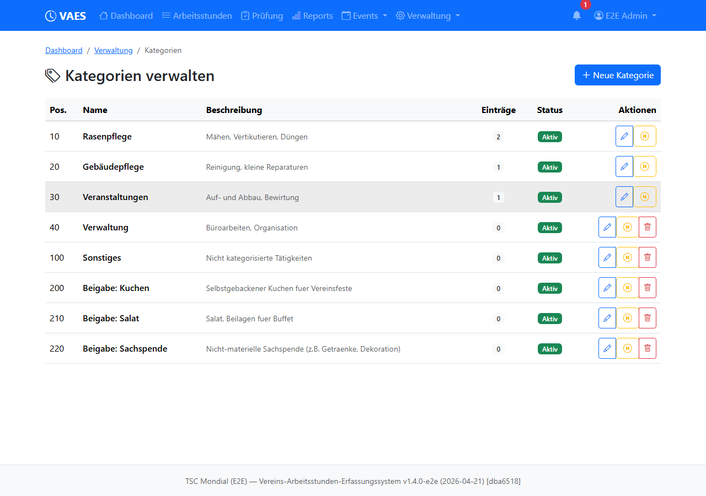

Erreichbar ueber **Verwaltung > Kategorien**.

Kategorien definieren die Art der geleisteten Arbeit (z.B. "Vereinsheim", "Sportplatz", "Veranstaltung").

#### Kategorie erstellen

1. Klicken Sie auf **Neue Kategorie**. Es oeffnet sich ein Dialog-Fenster.
2. Fuellen Sie das Formular aus:
   - **Name** (Pflicht, max. 100 Zeichen)
   - **Beschreibung** (optional, max. 500 Zeichen)
   - **Sortierung** (Zahl fuer die Reihenfolge in der Anzeige)
3. Klicken Sie auf **Erstellen**.

#### Kategorie bearbeiten

Klicken Sie auf das **Stift-Symbol** neben der Kategorie. Es oeffnet sich ein Dialog-Fenster mit den aktuellen Werten.

#### Kategorie deaktivieren / aktivieren

- **Deaktivieren:** Die Kategorie erscheint nicht mehr in der Auswahl fuer neue Eintraege. Bestehende Eintraege bleiben zugeordnet.
- **Aktivieren:** Die Kategorie ist wieder auswaehlbar.

#### Kategorie loeschen

Kategorien koennen nur geloescht werden, wenn ihnen keine Eintraege zugeordnet sind. Andernfalls muessen Sie die Kategorie deaktivieren.

**Hinweis:** Die Tabelle zeigt neben jeder Kategorie die Anzahl zugeordneter Eintraege an.

### 12.3 Soll-Stunden verwalten

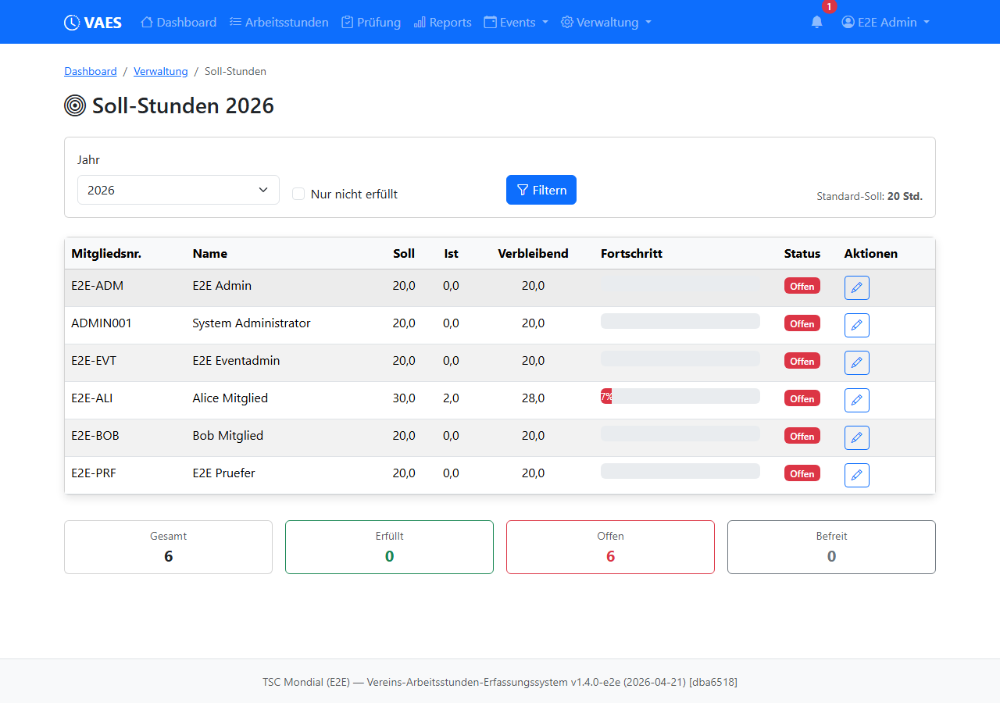

Erreichbar ueber **Verwaltung > Soll-Stunden**.

Die Soll-Stunden-Funktion ermoeglicht es, fuer jedes Mitglied ein jaehrliches Stundenziel zu definieren.

#### Funktion aktivieren

Die Soll-Stunden-Funktion muss zunaechst in den **Systemeinstellungen** aktiviert werden (Einstellung: "Soll-Stunden aktiviert"). Dort kann auch der Standard-Soll-Wert definiert werden.

#### Uebersicht

Die Uebersichtsseite zeigt fuer das gewaehlte Jahr:
- Tabellarische Auflistung aller Mitglieder mit Soll, Ist, Differenz und Fortschrittsbalken
- Zusammenfassung: Gesamt, Erfuellt (gruen), Offen (rot), Befreit (grau)
- Filter: Jahresauswahl, Nur nicht erfuellte anzeigen

#### Individuelle Ziele setzen

1. Klicken Sie auf das **Stift-Symbol** neben einem Mitglied.
2. Aendern Sie die **Soll-Stunden** (ueberschreibt den Standard-Wert).
3. Optional: Setzen Sie das Haekchen **Von Soll-Stunden befreit**.
4. Optional: Fuegen Sie eine **Notiz** hinzu (z.B. Begruendung fuer Befreiung).
5. Klicken Sie auf **Speichern**.

### 12.4 Event-Verwaltung

Erreichbar ueber **Verwaltung > Events** (Rolle **Event-Admin** oder **Administrator**).

#### Event-Liste

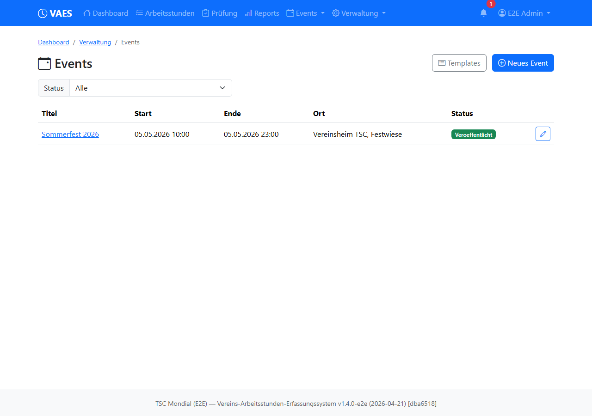

Die Uebersicht zeigt alle Events mit Datum, Status, Anzahl belegter/offener Plaetze und Aktionen (Ansehen, Bearbeiten, Loeschen).

Filter: Status (Geplant / Laufend / Abgeschlossen / Abgesagt), Zeitraum, Textsuche.

#### Event erstellen

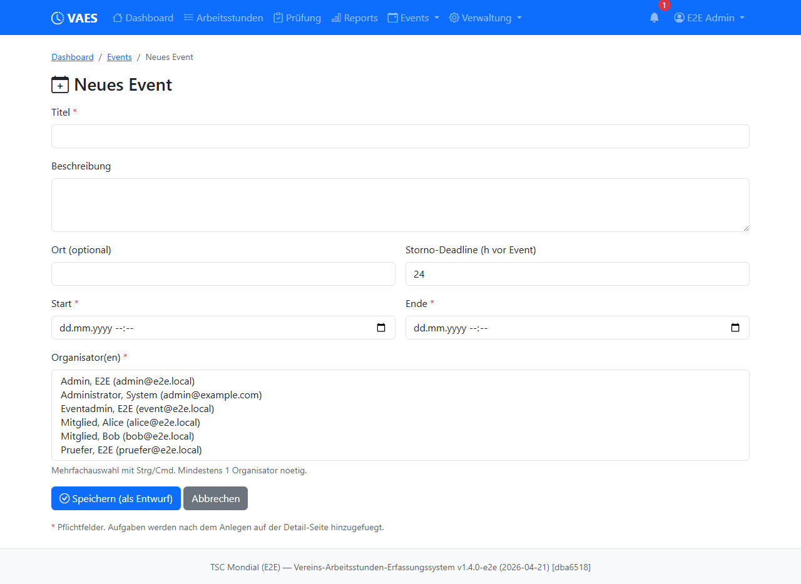

1. Klicken Sie auf **Neues Event**.
2. Geben Sie Titel, Beschreibung, Datum, Start-/Endzeit und Ort ein.
3. Waehlen Sie die **Standard-Kategorie**, die bei automatisch erzeugten Arbeitsstunden gesetzt wird.
4. Optional: Waehlen Sie eine **Event-Vorlage** (siehe 12.5). Dabei werden die Aufgaben aus der Vorlage kopiert.
5. Fuegen Sie **Aufgaben** hinzu. Pro Aufgabe definieren Sie:
   - Name (z.B. "Aufbau", "Theke & Getraenke")
   - Beschreibung
   - Anzahl benoetigter Helfer
   - Stunden pro Helfer
   - Optional: Start-/Endzeit (abweichend vom Event-Rahmen)
6. Klicken Sie auf **Event speichern**.

Das Event erscheint sofort in der oeffentlichen Eventliste. Mitglieder koennen die Aufgaben uebernehmen.

#### Event-Detailansicht (Admin)

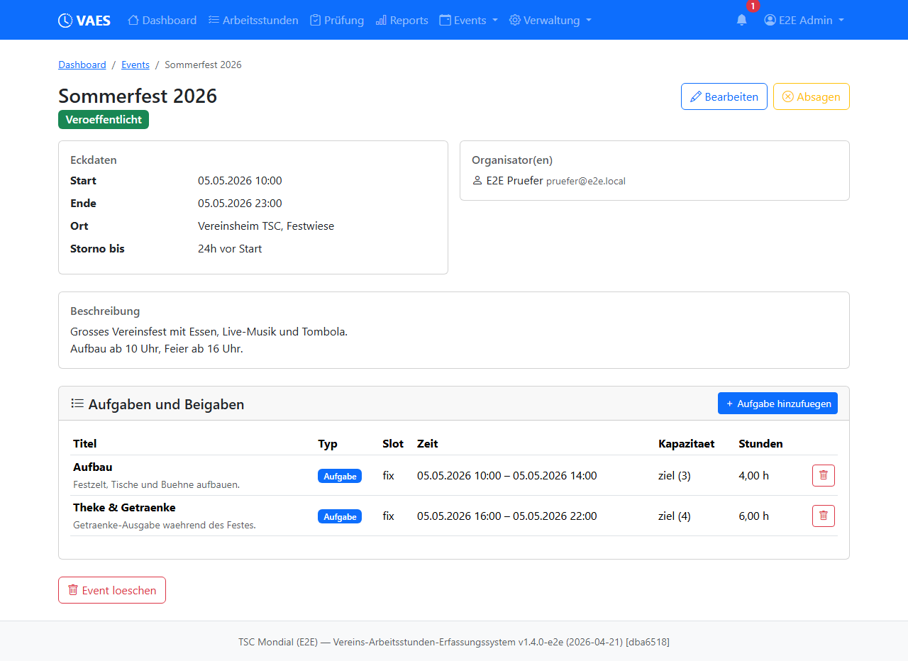

In der Detailansicht pflegen Sie:

- **Organisatoren:** Mitglieder zuweisen, die das Event vor Ort verantworten. Organisatoren duerfen Zuweisungen Dritter bearbeiten.
- **Aufgaben:** Hinzufuegen, bearbeiten, loeschen.
- **Manuelle Zuweisungen:** Helfer direkt einer Aufgabe zuordnen (z.B. aus Telefonliste).
- **Ersatz-Vorschlaege:** Vorschlaege zustimmen oder ablehnen.
- **Status wechseln:** Von **Geplant** zu **Laufend**, **Abgeschlossen** oder **Abgesagt**. Beim Wechsel zu **Abgeschlossen** werden automatisch Arbeitsstunden-Eintraege fuer alle Zuweisungen erzeugt.

**Abgeschlossene Events** koennen nicht mehr editiert werden. Bereits erzeugte Arbeitsstunden koennen der Eigentuemer, der Pruefer (Korrektur) oder der Admin bearbeiten.

#### Event loeschen

Events koennen nur geloescht werden, solange keine Zuweisungen bestehen oder keine Arbeitsstunden aus ihnen erzeugt wurden. In allen anderen Faellen wird das Event **Abgesagt** -- bestehende Zuweisungen bleiben als Historie sichtbar.

#### Aufgabenbaum-Editor (optional aktivierbar)

Ab VAES 1.4.1 kann der Administrator unter **Systemeinstellungen** den Aufgabenbaum-Editor freischalten (`events.tree_editor_enabled = 1`). Ist das Flag gesetzt, erscheint auf der Seite **Event bearbeiten** unterhalb des Event-Formulars ein neuer Abschnitt **Aufgabenbaum**. Dort lassen sich Aufgaben in einer Hierarchie aus **Gruppen-Knoten** und **Aufgaben-Knoten** (Leaves) pflegen, statt wie bisher als flache Liste.

**Zweck:** Groessere Events (Turnier, Festival, Saison-Abschluss) lassen sich in logische Bereiche (Gruppen) unterteilen -- z.B. *Thekendienst > Essensausgabe > Nachmittagsschicht* -- und Helfer-Stunden aggregieren automatisch pro Bereich.

##### Struktur

- **Gruppen-Knoten** (Ordner-Symbol) fassen weitere Knoten zusammen. Sie haben **keine** eigenen Slots, Kapazitaeten oder Helfer-Stunden -- diese Felder stehen nur auf Aufgaben-Knoten.
- **Aufgaben-Knoten** (Clipboard-Symbol) sind konkrete Helfer-Taetigkeiten mit Slot-Modus, Kapazitaet und Stunden.

##### Bedienung

**Wichtig:** Jeder Knoten hat links ein kleines **Griff-Symbol** (drei kurze vertikale Linien, `⁝⁝`). **Nur an diesem Griff** laesst sich der Knoten per Drag & Drop an eine andere Position oder in eine andere Gruppe ziehen. Klicken auf den Titel oeffnet den Bearbeiten-Dialog, nicht das Verschieben.

Tipp: Der Mauszeiger wird ueber dem Griff zu einer "Hand" (`grab`). Wenn der Zeiger nicht wechselt, sind Sie zu weit vom Griff entfernt.

Aktionen an jedem Knoten (Symbole rechts):

| Symbol | Aktion | Verfuegbar bei |
|--------|--------|----------------|
| `+` Plus-Kreis | Unter-Knoten hinzufuegen | nur Gruppen-Knoten |
| Stift | Knoten bearbeiten (oeffnet Dialog) | alle Knoten |
| Pfeile-Rund | In anderen Typ konvertieren (Gruppe <-> Aufgabe) | Gruppen ohne Kinder; Aufgaben ohne Zusagen |
| Muelleimer | Knoten loeschen | Gruppen ohne Kinder; Aufgaben ohne Zusagen |

Deaktivierte Aktionen (ausgegraut, mit Tooltip) erklaeren, warum die Aktion gerade nicht moeglich ist, z.B. *"Loeschen abgelehnt: Gruppe enthaelt aktive Aufgaben"*.

##### Verschieben per Drag & Drop

1. Mauszeiger auf das **Griff-Symbol** des zu verschiebenden Knotens bewegen. Der Zeiger wird zu einer Hand.
2. Mausbutton gedrueckt halten und den Knoten auf seine neue Position ziehen -- innerhalb einer Gruppe zur Umsortierung, oder auf eine andere Gruppe, um umzuhaengen.
3. Mausbutton loslassen. Der Server speichert die neue Position sofort; eine kurze Bestaetigung erscheint unten rechts.

Auf Mobilgeraeten: Finger **kurz auf dem Griff halten** (ca. 200 ms), dann bewegen. Das verhindert versehentliches Verschieben beim Scrollen.

**Regeln, die der Server prueft**:
- Maximaltiefe **4 Ebenen** (Standard, vom Administrator anpassbar). Tieferes Verschachteln wird abgelehnt.
- Ein Gruppen-Knoten darf nur in eine andere Gruppe (nicht in eine Aufgabe) verschoben werden.
- Ein Knoten darf nicht in seinen eigenen Unterbaum gezogen werden (Zyklus-Schutz).

Schlaegt eine Verschiebung fehl, rollt die UI den Knoten an die Ausgangsposition zurueck und zeigt eine Fehlermeldung mit der genauen Ursache.

##### Knoten anlegen, bearbeiten, konvertieren, loeschen

**Anlegen:**
- Button **Knoten anlegen** ganz oben legt einen Top-Level-Knoten an.
- Das Plus-Symbol an einem Gruppen-Knoten legt einen Unter-Knoten innerhalb dieser Gruppe an.

Im Anlegen-Dialog waehlen Sie zuerst den **Typ** (Gruppe oder Aufgabe). Bei *Aufgabe* erscheinen die zusaetzlichen Felder (Slot-Modus, Kapazitaet, Stunden, Start/Ende).

**Bearbeiten:** Stift-Symbol oder Klick auf den Titel. Der Typ laesst sich hier **nicht** wechseln -- dafuer gibt es die separate Konvertieren-Aktion.

**Konvertieren:**
- *Gruppe -> Aufgabe*: Nur moeglich, wenn die Gruppe keine aktiven Unter-Knoten hat. Im Dialog werden dann die Leaf-Attribute (Slot, Kapazitaet, Stunden) angefordert.
- *Aufgabe -> Gruppe*: Nur moeglich, wenn die Aufgabe keine aktiven Zusagen hat. Die Leaf-Attribute werden **verworfen** -- Gruppen haben diese Felder nicht.

**Loeschen:** Muelleimer. Nur moeglich, wenn keine aktiven Kinder (bei Gruppen) bzw. keine aktiven Zusagen (bei Aufgaben) bestehen. Die Loeschung ist ein Soft-Delete -- der Audit-Trail behaelt die vollstaendige Historie.

##### Aggregierte Anzeige

Rechts neben jedem Gruppen-Knoten erscheinen drei kleine Badges:

| Badge | Bedeutung |
|-------|-----------|
| Personen | Summe der benoetigten Helfer aller Aufgaben im Teilbaum |
| Sanduhr | Offene Slots (benoetigt minus bereits zugesagt) |
| Uhr | Summe der Standard-Stunden aller Aufgaben im Teilbaum |

Bei Aufgaben-Knoten zeigen die Badges die Werte des Knotens selbst, nicht aggregiert.

##### Barrierefreiheit / ohne JavaScript

Drag & Drop und der Bearbeiten-Dialog benoetigen JavaScript. Ist JavaScript deaktiviert, erscheint ein Hinweis -- in diesem Fall bitte die bisherige flache Aufgabenverwaltung auf der Event-Detailseite nutzen.

### 12.5 Event-Vorlagen

Erreichbar ueber **Verwaltung > Event-Vorlagen**.

Vorlagen beschleunigen die Anlage wiederkehrender Formate (z.B. "Saison-Abschlussfest", "Hauptversammlung", "Turnier-Wochenende"). Eine Vorlage enthaelt einen Grundriss aus Aufgaben, die beim Erstellen eines konkreten Events kopiert werden.

#### Vorlagen-Liste

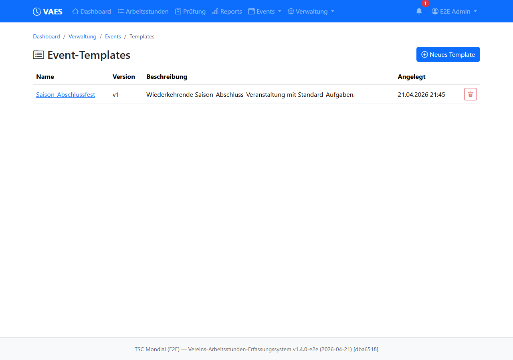

Zeigt alle Vorlagen mit Name, Anzahl Aufgaben und Anzahl Events, die aus dieser Vorlage erzeugt wurden.

#### Vorlage erstellen / bearbeiten

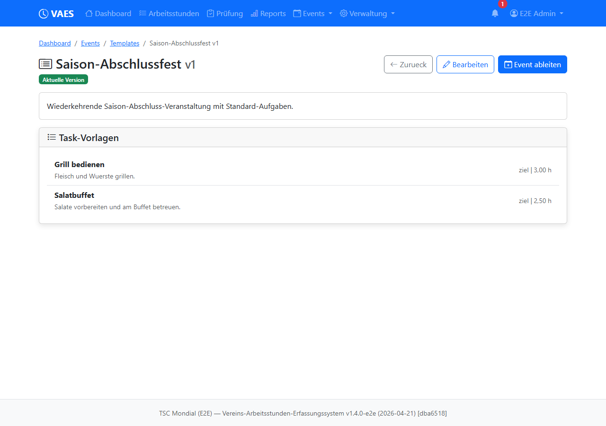

1. Klicken Sie auf **Neue Vorlage** bzw. das Stift-Symbol.
2. Geben Sie Name und Beschreibung ein.
3. Legen Sie Aufgaben an (analog zu 12.4).
4. Speichern.

**Tipp:** Beim Erstellen eines neuen Events kann die Vorlage als **Basis** ausgewaehlt werden -- Sie muessen dann nur Datum, Ort und event-spezifische Details eintragen.

#### Vorlage loeschen

Vorlagen koennen jederzeit geloescht werden. Bereits erzeugte Events bleiben unberuehrt, da die Aufgaben im Event-Datensatz kopiert (nicht verlinkt) sind.

### 12.6 Systemeinstellungen

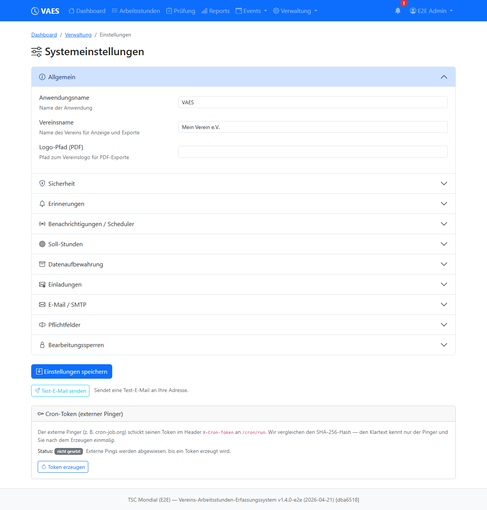

Erreichbar ueber **Verwaltung > Einstellungen**.

Die Einstellungen sind in aufklappbare Gruppen unterteilt (Akkordeon):

#### Allgemein
- **App-Name** - Name der Anwendung
- **Vereinsname** - Name des Vereins (erscheint im Footer und auf PDFs)
- **Logo-Pfad** - Pfad zum Vereinslogo fuer PDF-Exporte

#### Sicherheit
- **Session-Timeout** - Automatische Abmeldung nach Inaktivitaet (Minuten, mindestens 5)
- **Maximale Fehlversuche** - Anzahl erlaubter Fehlanmeldungen vor Kontosperre (mindestens 1)
- **Sperrdauer** - Dauer der Kontosperre nach zu vielen Fehlversuchen (Minuten)
- **2FA erforderlich** - Erzwingt die Einrichtung der Zwei-Faktor-Authentifizierung fuer alle Benutzer
- **Rate-Limit Passwort-Reset (IP)** - Maximale Reset-Anfragen pro IP-Adresse pro Zeitfenster
- **Rate-Limit Passwort-Reset (E-Mail)** - Maximale Reset-Anfragen pro Ziel-E-Mail pro Zeitfenster

#### Erinnerungen
- **Erinnerungstage** - Nach wie vielen Tagen ohne Aktivitaet eine Erinnerung gesendet wird
- **Erinnerungen aktiviert** - Ein-/Ausschalten der Erinnerungsfunktion

#### Soll-Stunden
- **Soll-Stunden aktiviert** - Aktiviert die Soll-Stunden-Funktion und die Dashboard-Anzeige
- **Standard-Soll-Stunden** - Jaehrliches Standardziel fuer alle Mitglieder

#### Datenaufbewahrung
- **Aufbewahrungsfrist** - Wie lange Daten aufbewahrt werden (Jahre, mindestens 3)
- **Einladungs-Gueltigkeit** - Wie lange ein Einladungslink gueltig ist (Tage, mindestens 1)

#### E-Mail / SMTP
- **SMTP-Server** - Hostname des Mailservers (z.B. securesmtp.t-online.de)
- **SMTP-Port** - Port (meist 587 fuer TLS oder 465 fuer SSL)
- **SMTP-Benutzername** - Zugangsdaten fuer den Mailserver
- **SMTP-Passwort** - Passwort fuer den Mailserver
- **Verschluesselung** - TLS oder SSL
- **Absender-Adresse** - E-Mail-Adresse, von der gesendet wird
- **Absender-Name** - Anzeigename des Absenders

Ueber den Button **Test-E-Mail senden** koennen Sie pruefen, ob die SMTP-Konfiguration funktioniert. Die Test-E-Mail wird an Ihre eigene Adresse gesendet.

#### Feldkonfiguration
Fuer jedes Feld im Stundenerfassungsformular kann festgelegt werden:
- **Pflichtfeld** - Muss ausgefuellt werden
- **Optional** - Kann ausgefuellt werden
- **Ausgeblendet** - Wird im Formular nicht angezeigt

Konfigurierbare Felder: Datum, Uhrzeit von, Uhrzeit bis, Stunden, Kategorie, Projekt, Beschreibung.

#### Bearbeitungssperren
- **Sperr-Timeout** - Dauer, nach der eine Bearbeitungssperre automatisch aufgehoben wird (Minuten)

### 12.7 Audit-Trail

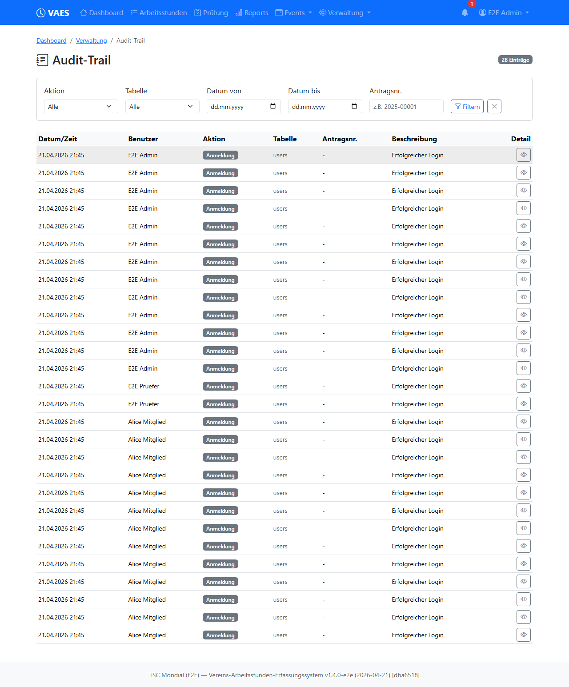

Erreichbar ueber **Verwaltung > Audit-Trail** (Admin) oder **Audit-Trail** in der Navigation (Auditor).

Der Audit-Trail protokolliert alle Aenderungen im System lueckenlos. Jeder Eintrag enthaelt:

| Feld | Beschreibung |
|------|--------------|
| **Zeitpunkt** | Datum und Uhrzeit der Aenderung |
| **Benutzer** | Wer die Aenderung durchgefuehrt hat |
| **Aktion** | Art der Aenderung (farbig codiert) |
| **Tabelle** | Betroffener Datenbereich |
| **Beschreibung** | Menschenlesbare Zusammenfassung |
| **Eintragsnummer** | Betroffene Eintragsnummer (falls zutreffend) |

**Aktionstypen und Farben:**

| Aktion | Badge-Farbe | Beispiel |
|--------|-------------|---------|
| Erstellen | Gruen | Neuer Eintrag angelegt |
| Aendern | Blau | Eintrag aktualisiert |
| Loeschen | Rot | Eintrag geloescht |
| Wiederherstellen | Hellblau | Eintrag reaktiviert |
| Status-Aenderung | Hellblau | Status von Entwurf zu Eingereicht |
| Anmeldung/Abmeldung | Grau | Benutzer angemeldet |
| Fehlgeschlagene Anmeldung | Gelb | Ungueltige Anmeldedaten |
| Export/Import | Dunkel | PDF-Export erstellt |
| Dialog-Nachricht | Hell | Neue Nachricht im Dialog |
| Konfigurations-Aenderung | Lila | Rolle geaendert, Einstellung angepasst |

**Filter:**
- Aktion (Erstellen, Aendern, Loeschen, etc.)
- Tabelle
- Zeitraum (Von / Bis)
- Eintragsnummer

**Detailansicht:**
Klicken Sie auf das Auge-Symbol bei einem Audit-Eintrag, um die vollstaendigen Daten zu sehen, einschliesslich der alten und neuen Werte, IP-Adresse, Browser-Information und Session-ID.

**Manipulationsschutz:** Der Audit-Trail ist **append-only**. Eintraege koennen weder geaendert noch geloescht werden -- auch nicht von Administratoren. Dies wird auf Datenbankebene durch Trigger erzwungen.

---

## 13. Mehrfach-Browser-Nutzung (Multitab-Schutz)

VAES verhindert, dass ein Eintrag versehentlich gleichzeitig in mehreren Browser-Tabs bearbeitet oder durch den Workflow geschickt wird. Der Schutz wirkt auf drei Ebenen:

**1. Pessimistische Bearbeitungssperre (Edit-Lock):**
Beim Oeffnen eines Eintrags im Bearbeitungsmodus setzt das System eine Sperre. Oeffnet eine zweite Sitzung denselben Eintrag, erscheint ein Hinweis: *"Dieser Eintrag wird bereits von [Name] bearbeitet. Sie koennen ihn nur lesen."* Der zweite Tab wird nicht zum Schreiben zugelassen, bis die erste Sitzung ihre Bearbeitung abschliesst oder die Sperre nach dem in den Systemeinstellungen konfigurierten **Sperr-Timeout** automatisch ausgelaufen ist.

**2. Optimistische Versions-Pruefung:**
Jeder Eintrag hat eine interne Versionsnummer. Beim Absenden eines Formulars (Speichern, Einreichen, Status-Wechsel) vergleicht das System die beim Laden uebergebene Versionsnummer mit der aktuellen. Wurde inzwischen von jemand anderem etwas geaendert, erscheint die Meldung: *"Der Eintrag wurde zwischenzeitlich veraendert. Bitte laden Sie die Seite neu und pruefen Sie den aktuellen Stand."* -- Ihre Eingabe wird NICHT unbemerkt ueberschrieben.

**3. Tab-Synchronisation (BroadcastChannel):**
Wenn Sie denselben Eintrag in mehreren Tabs innerhalb desselben Browsers offen haben und einen Status-Wechsel durchfuehren, erhalten die anderen Tabs sofort einen Hinweis und laden automatisch neu. Dadurch sehen Sie in allen Tabs denselben aktuellen Stand.

**Was Sie tun sollten, wenn die Meldung erscheint:**

| Meldung | Ursache | Aktion |
|---------|---------|--------|
| "Wird bereits bearbeitet" | Edit-Lock vorhanden | Anderen Tab schliessen oder warten, bis der Lock ausgelaufen ist |
| "Eintrag wurde veraendert" | Version veraltet | Seite neu laden, Stand pruefen, ggf. neu eingeben |
| Tab wurde automatisch neu geladen | BroadcastChannel-Sync | Nichts -- Sie sehen jetzt den aktuellen Stand |

**Technischer Hintergrund:** Der Schutz folgt dem Prinzip **"niemals stille Datenueberschreibung"**. Lieber einmal einen Nutzer zum Neuladen bitten, als einen Bearbeitungskonflikt geraeuschlos zu verschlucken.

---

## 14. Rollen und Berechtigungen

VAES verwendet ein rollenbasiertes Berechtigungssystem. Jedem Benutzer koennen eine oder mehrere Rollen zugewiesen werden.

### 14.1 Mitglied

Die Basisrolle fuer alle Vereinsmitglieder.

**Berechtigungen:**
- Eigene Arbeitsstunden erfassen und verwalten
- Eigene Eintraege als Entwurf speichern, einreichen, zurueckziehen, stornieren, reaktivieren
- Eigene Eintraege im Entwurfsstatus bearbeiten und loeschen
- Dialog-Nachrichten zu eigenen Eintraegen senden und empfangen
- Persoenliche Reports einsehen und exportieren
- Soll-Stunden-Fortschritt auf dem Dashboard sehen
- Events ansehen, Aufgaben uebernehmen und zuruecknehmen
- Eigenes iCal-Abonnement einrichten und Token zuruecksetzen

### 14.2 Erfasser

Erweiterte Rolle fuer die Erfassung von Stunden im Auftrag anderer Mitglieder.

**Zusaetzliche Berechtigungen:**
- Arbeitsstunden fuer andere Mitglieder erfassen
- Eintraege im Auftrag anderer einreichen

**Hinweis:** Der Erfasser kann die von ihm fuer andere erstellten Eintraege auch bearbeiten und zurueckziehen, solange sie im Status Entwurf sind.

### 14.3 Pruefer

Rolle fuer die Freigabe von Arbeitsstunden.

**Zusaetzliche Berechtigungen:**
- Alle eingereichten und in Klaerung befindlichen Eintraege einsehen
- Eintraege freigeben, ablehnen oder zur Klaerung zuruecksenden
- Stunden an freigegebenen Eintraegen korrigieren
- Rueckfragen im Dialog stellen
- Reports aller Mitglieder einsehen

**Einschraenkung:** Eigene Eintraege oder Eintraege, die man als Erfasser erstellt hat, koennen nicht genehmigt werden.

### 14.4 Auditor

Lesezugriff auf das gesamte System fuer Pruefungszwecke.

**Berechtigungen:**
- Alle Eintraege aller Mitglieder einsehen (nur lesen)
- Vollstaendigen Audit-Trail einsehen
- Reports aller Mitglieder einsehen

**Einschraenkung:** Kein Schreibzugriff. Kann keine Eintraege erstellen, bearbeiten oder genehmigen.

### 14.5 Event-Admin

Spezialrolle fuer die Event-Verwaltung.

**Zusaetzliche Berechtigungen:**
- Events anlegen, bearbeiten, abschliessen, absagen
- Aufgaben definieren und Helfer manuell zuweisen
- Event-Vorlagen pflegen
- Ersatz-Vorschlaege bestaetigen

**Hinweis:** Event-Admin hat keinen Zugriff auf Mitglieder-, Kategorie- oder Systemverwaltung. Ein Event-Admin muss zusaetzlich die Rolle **Mitglied** (fuer eigene Stundenerfassung) haben.

### 14.6 Administrator

Vollzugriff auf alle Funktionen des Systems.

**Zusaetzliche Berechtigungen:**
- Mitglieder anlegen, bearbeiten, deaktivieren, reaktivieren
- CSV-Import durchfuehren
- Rollen zuweisen
- Einladungen versenden
- Kategorien verwalten
- Soll-Stunden konfigurieren
- Systemeinstellungen aendern
- Audit-Trail einsehen
- Alle Pruefer-Funktionen (mit Selbstgenehmigungs-Einschraenkung)
- Alle Event-Admin-Funktionen

### 14.7 Berechtigungsmatrix

| Funktion | Mitglied | Erfasser | Pruefer | Auditor | Event-Admin | Admin |
|----------|----------|----------|---------|---------|-------------|-------|
| Eigene Stunden erfassen | Ja | Ja | Ja | Nein | Ja (als Mitglied) | Ja |
| Stunden fuer andere erfassen | Nein | Ja | Nein | Nein | Nein | Nein |
| Eigene Eintraege verwalten | Ja | Ja | Ja | Nein | Ja (als Mitglied) | Ja |
| Alle Eintraege einsehen | Nein | Nein | Ja | Ja | Nein | Ja |
| Eintraege freigeben/ablehnen | Nein | Nein | Ja | Nein | Nein | Ja |
| Rueckfragen stellen | Nein | Nein | Ja | Nein | Nein | Ja |
| Stunden korrigieren | Nein | Nein | Ja | Nein | Nein | Ja |
| Reports (eigene) | Ja | Ja | Ja | Ja | Ja (als Mitglied) | Ja |
| Reports (alle Mitglieder) | Nein | Nein | Ja | Ja | Nein | Ja |
| PDF/CSV-Export | Ja | Ja | Ja | Ja | Ja | Ja |
| Events ansehen / Aufgabe uebernehmen | Ja | Ja | Ja | Ja | Ja | Ja |
| Events verwalten | Nein | Nein | Nein | Nein | Ja | Ja |
| Event-Vorlagen verwalten | Nein | Nein | Nein | Nein | Ja | Ja |
| Mitglieder verwalten | Nein | Nein | Nein | Nein | Nein | Ja |
| Kategorien verwalten | Nein | Nein | Nein | Nein | Nein | Ja |
| Soll-Stunden verwalten | Nein | Nein | Nein | Nein | Nein | Ja |
| Systemeinstellungen | Nein | Nein | Nein | Nein | Nein | Ja |
| Audit-Trail | Nein | Nein | Nein | Ja | Nein | Ja |

---

## 15. Haeufige Fragen (FAQ)

**F: Ich habe mein Passwort vergessen. Was kann ich tun?**
A: Klicken Sie auf der Anmeldeseite auf "Passwort vergessen?" und geben Sie Ihre E-Mail-Adresse ein. Sie erhalten einen Link zum Zuruecksetzen.

**F: Mein Konto ist gesperrt. Was kann ich tun?**
A: Nach zu vielen fehlgeschlagenen Anmeldeversuchen wird Ihr Konto voruebergehend gesperrt. Warten Sie die Sperrdauer ab (standardmaessig 15 Minuten) und versuchen Sie es erneut. Falls das Problem bestehen bleibt, wenden Sie sich an Ihren Administrator.

**F: Mein Einladungslink ist abgelaufen. Was kann ich tun?**
A: Bitten Sie Ihren Administrator, Ihnen eine neue Einladung zu senden. Dies ist in der Mitgliederverwaltung ueber den Button "Einladung erneut senden" moeglich.

**F: Meine Authenticator-App zeigt den falschen Code an. Was kann ich tun?**
A: Pruefen Sie, ob die Uhrzeit auf Ihrem Smartphone korrekt eingestellt ist. Authenticator-Apps berechnen den Code anhand der aktuellen Uhrzeit. Aktivieren Sie die automatische Zeitsynchronisation:
- **iPhone:** Einstellungen > Allgemein > Datum & Uhrzeit > "Automatisch einstellen" aktivieren
- **Android:** Einstellungen > System > Datum & Uhrzeit > "Automatisches Datum und Uhrzeit" aktivieren

**F: Ich habe mein Smartphone verloren/gewechselt. Wie komme ich an meinen 2FA-Code?**
A: Wenden Sie sich an Ihren Administrator. Dieser kann Ihre 2FA-Konfiguration zuruecksetzen. Bei der naechsten Anmeldung werden Sie aufgefordert, 2FA erneut einzurichten. Falls Sie Authy verwenden und das Cloud-Backup aktiviert hatten, koennen Sie Authy auf dem neuen Geraet installieren und Ihre Konten wiederherstellen.

**F: Kann ich von der Authenticator-App zur E-Mail-Methode wechseln (oder umgekehrt)?**
A: Bitten Sie Ihren Administrator, Ihre 2FA-Konfiguration zurueckzusetzen. Bei der naechsten Anmeldung koennen Sie die gewuenschte Methode neu einrichten.

**F: Kann ich einen bereits freigegebenen Eintrag aendern?**
A: Nein, freigegebene Eintraege koennen nicht mehr bearbeitet werden. Ein Pruefer kann jedoch die Stundenzahl nachtraeglich korrigieren (mit Begruendung).

**F: Warum kann ich meinen eigenen Antrag nicht genehmigen?**
A: Das System verhindert die Selbstgenehmigung als Sicherheitsmassnahme (Vier-Augen-Prinzip). Ein anderer Pruefer muss Ihren Antrag pruefen und freigeben.

**F: Kann ich einen abgelehnten Eintrag erneut einreichen?**
A: Nein, der Status "Abgelehnt" ist ein Endstatus. Sie muessen einen neuen Eintrag erstellen.

**F: Was passiert, wenn ich einen Eintrag storniere?**
A: Stornierte Eintraege werden nicht gewertet, bleiben aber im System erhalten. Sie koennen einen stornierten Eintrag reaktivieren, wodurch er in den Status "Entwurf" zurueckkehrt.

**F: Wie sehe ich, ob ich meine Soll-Stunden erreicht habe?**
A: Sofern die Soll-Stunden-Funktion aktiviert ist, sehen Sie Ihren Fortschritt als Balkendiagramm auf dem Dashboard. Nur Eintraege im Status "Freigegeben" werden als Ist-Stunden gezaehlt.

**F: Werden meine Daten bei einer Loeschung wirklich geloescht?**
A: Nein, VAES verwendet Soft-Delete. Geloeschte Eintraege und deaktivierte Benutzer werden intern als geloescht markiert, bleiben aber fuer den Audit-Trail erhalten.

**F: Warum sehe ich bestimmte Menuepunkte nicht?**
A: Die sichtbaren Menuepunkte haengen von Ihren zugewiesenen Rollen ab. Wenden Sie sich an Ihren Administrator, wenn Sie eine zusaetzliche Rolle benoetigen.

**F: Wie funktioniert die automatische Aktualisierung auf dem Dashboard?**
A: Das Dashboard prueft alle 60 Sekunden im Hintergrund, ob sich die Anzahl ungelesener Nachrichten geaendert hat. Falls ja, wird die Seite automatisch neu geladen. In der Navigationsleiste wird das Glocken-Symbol auf allen Seiten aktualisiert.

**F: Ich sehe keine Kategorien in der Auswahl. Was kann ich tun?**
A: Kategorien muessen vom Administrator angelegt und aktiviert werden. Wenden Sie sich an Ihren Administrator.

**F: Welche Browser werden unterstuetzt?**
A: VAES funktioniert mit allen modernen Browsern: Firefox, Chrome, Edge und Safari (jeweils aktuelle Version). Internet Explorer wird nicht unterstuetzt.

**F: Ich habe eine Event-Aufgabe uebernommen -- wann bekomme ich die Stunden?**
A: Sobald der Event-Admin das Event auf "Abgeschlossen" setzt, erzeugt das System automatisch einen Arbeitsstunden-Eintrag in Ihrem Namen (Status: Eingereicht). Ein Pruefer gibt diesen dann frei.

**F: Ich kann bei einer Event-Aufgabe nicht mehr teilnehmen. Was kann ich tun?**
A: Solange das Event noch nicht abgeschlossen ist, koennen Sie Ihren Platz in der Event-Detailansicht ueber **Zuweisung entfernen** freigeben. Alternativ koennen Sie einen **Ersatz-Vorschlag** machen, der vom Organisator bestaetigt werden muss.

**F: Was mache ich, wenn mein iCal-Kalender alte Termine noch anzeigt?**
A: Der Abo-Sync der Kalender-Programme laeuft typischerweise alle 15 Minuten bis 3 Stunden. Triggern Sie eine manuelle Aktualisierung (in den meisten Programmen ueber Rechtsklick auf den Kalender > "Aktualisieren"). Bei Verdacht auf einen kompromittierten Token setzen Sie den Token zurueck (**Meine Events > Kalender-Abo > Token zuruecksetzen**).

**F: Ich habe einen Antrag in zwei Tabs offen und beim Speichern erscheint "Der Eintrag wurde zwischenzeitlich veraendert". Was bedeutet das?**
A: Eine andere Sitzung (oder Sie selbst im anderen Tab) hat den Antrag nach dem Laden dieser Seite veraendert. VAES verhindert, dass Ihre ungeprueften Eingaben den neueren Stand stillschweigend ueberschreiben. Laden Sie die Seite neu, pruefen Sie den aktuellen Zustand und geben Sie Ihre Aenderung ggf. erneut ein (siehe Abschnitt 13).

**F: Warum sehe ich im oeffentlichen Internet ein Zertifikats-/HTTPS-Warnsymbol?**
A: VAES sendet einen strengen Satz Security-Header (CSP, HSTS, Permissions-Policy). Auf korrekt konfigurierten Hostings sollte kein Warnsymbol auftreten. Falls doch, wenden Sie sich an den Administrator -- das kann auf einen Konfigurationsfehler im Hosting hinweisen.

---

*VAES Benutzerhandbuch - Version 1.4.0*
*Letzte Aktualisierung: April 2026*
